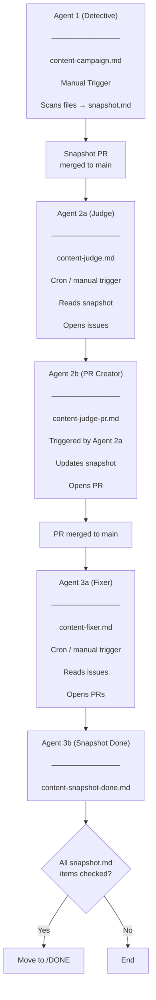

# ContentHawk - Agentic Content Audit Pipeline

ContentHawk is a multi-agent pipeline that scans, judges, and fixes content in the SSW.Rules repository. It uses GitHub Actions agentic workflows to coordinate a chain of AI agents that discover outdated or problematic content using a campaign system. Triggering the workflow will add a lock file to `.github/ContentHawk/TODO` with a list of files to review & update based on the criteria specified by the user. A sub-agent will then assess each file listed in the lock file based on the intent of the campaign and either skip updating it or create a GitHub issue detailing the changes. Finally, a sub-agent will read the issues, and create a pull request updating the content. The number of issues closed by a pull request is specified by the user at the beginning of the campaign. When all files in a content campaign have been checked the file will be move to `.github/ContentHawk/DONE`, marking the end of the campaign.

## Pipeline Overview



## How to Run

| Agent | How to trigger | Notes |
|-------|---------------|-------|
| Agent 1 (Detective) | Run `/content-campaign` in Claude Code **or** dispatch `content-campaign.lock.yml` from GitHub Actions with all 6 inputs | This agent generates the snapshot file used for the content campaign. The Snapshot file is the source of truth for the campaign, it defines what needs to be reviewed and updated and the progress for the current content campaign. Deleting the snapshot file or moving it from `.github/ContentHawk/TODO` will stop the campaign. |
| Agent 2a (Judge) | Runs automatically once a week on cron, or manually by triggering `content-judge.lock.yml` | `Agent 2a` is responsible for creating work items to update the content based on the snapshot file. It uses the snapshot files as the source of truth for which kind of content changes need to be made and which files need to be checked. |
| Agent 2b (PR Creator) | Triggered automatically by `Agent 2a` after it's workflow run completes.   | This agent simply updates the content lock/snapshot file to indicate which issues have been generated to fix each content file and which files have been skipped. This action determines which files have issues by searching for issues with a matching label and downloads the list of skipped files from an artifact uploaded by `Agent 2a`. |
| Agent 3a (Fixer) | Runs automatically on cron once a week, or dispatched manually using `Actions` \| `content-fixer.lock.yml` | Picks up the oldest TODO snapshot, checks for open issues in the snapshot file, and creates PRs with the work necessary to close the issue. |
| Agent 3b (Snapshot Done) | Triggered either when a ContentHawk issue is closed, or when a change is made to a snapshot file under `.github/ContentHawk/TODO/` | `Agent 3b` is responsible for marking snapshot items as done once all items have been checked and all issues generated have been resolved. If this is the case the agent will move the snapshot corresponding snapshot file to `.github/ContentHawk/DONE/`, ending the campaign. |

## Agents

### Agent 1 - Detective 🕵️

**Files:** `/.github/workflows/content-campaign.md` (GitHub Actions) and `/.claude/commands/content-campaign.md` (Claude Code slash command)

**Trigger:** Manual via GitHub Actions `workflow_dispatch` or Claude Code slash command `/content-campaign`

> **Note**: The /content-campaign command in Claude Code only currently works on `MacOS` due to the `cat` command not being available in the windows command prompt. To trigger the pipeline on Windows, please use the GitHub Actions manual trigger.

The entry point of the pipeline. A human operator provides:

| Input | Description |
|-------|-------------|
| Search Scope | Which content files to scan (e.g. ".NET rules that are not archived") |
| Processing Priority | Sort order for the file list |
| Intent | What downstream agents should look for (e.g. "archive all legacy rules") |
| Issue Preferences | How Agent 2a should create issues |
| PR Preferences | How Agent 3a should bundle PRs |
| Label Name | A kebab-case GitHub label slug to tie the pipeline together |

**What it does:**

1. Guards that the label does not already exist (avoids duplicate pipelines)
2. Creates the GitHub label provided by the user
3. Scans content files matching the user provided search scope
4. Sorts in the order specified by the user and filters by relevance to the intent (uses web search if needed)
5. Writes a snapshot tracking file to `.github/ContentHawk/TODO/<date>_Snapshot_<label>.md`
6. Opens a PR with the snapshot on a `ContentHawk/TODO/<label>` branch

**Output:** A snapshot file containing an Agent Configuration table and a Files to Review table with every matched file marked as `pending` or `skipped`.

---

### Agent 2a - Judge 🧑‍⚖️ (`/.github/workflows/content-judge.md`)

**Trigger:** `cron` (weekly) or manual `workflow_dispatch`

Picks up the oldest snapshot from the TODO folder and evaluates each pending file against the intent.

**What it does:**

1. Discovers the oldest snapshot in `.github/ContentHawk/TODO/`
2. Parses the snapshot for intent, label, issue preferences, and pending files
3. Checks issue headroom — exits if 30+ open issues already exist for the label
4. For each pending file:
   - Reads the file content
   - Judges whether it needs action based on the intent (uses Tavily web search for external context)
   - Opens a labeled GitHub issue if action is needed, or logs it as skipped
5. Triggers `Agent 2b` via `workflow_dispatch` in its post-step

**Guards:**
- Will not run if an open PR already already exists for `Agent 2b` with the same label
- Open issue limit (max 30 per label)
- Concurrency group `contenthawk-judge` (no parallel runs)


---

### Agent 2b - PR Creator (`/.github/workflows/content-judge-pr.md`)

**Trigger:** Triggered by `Agent 2a`'s post-step

Updates the snapshot.md file with the results of `Agent 2a`'s judging.

**Inputs (from Agent 2a):**

| Input | Description |
|-------|-------------|
| `snapshot_path` | Path to the snapshot file on main |
| `label_name` | The label slug for this pipeline run |
| `judge_run_id` | The Agent 2a workflow run ID |

**What it does:**

1. Guards against duplicate PRs using the reusable `guard-open-pr` action
2. Downloads the skipped files artifact from the Agent 2a run
3. Reads the snapshot and parses the Files to Review table
4. Searches GitHub for issues created by the judge run (matched via `contenthawk-run-id` in issue bodies)
5. Updates snapshot rows: `pending` -> `Issue #<number>` or `skipped`
6. Opens a PR on branch `ContentHawk/judge/<label>` with the updated snapshot

---

### Agent 3a - Fixer (`/.github/workflows/content-fixer.md`)

**Trigger:** `cron` or manual `workflow_dispatch`


Reads open issues for a snapshot's label and applies content fixes.

**What it does:**

1. Discovers the oldest snapshot in `.github/ContentHawk/TODO/`
2. Parses the snapshot for intent, PR preferences, and label
3. Fetches all open in the snapshot file table
4. Bundles eligible issues according to user specified PR Preferences
6. For each bundle:
   - Creates a branch `ContentHawk/fixer/<label>/<index>`
   - Reads each file, applies the fix based on the intent and issue suggestions
   - Uses Tavily web search when external context is needed
   - Creates a pull request with the changes and includes the issue number in the PR description as `Closes #<number>`

**Guards:**
- Deduplication against existing open fixer PRs
- Concurrency group `contenthawk-fixer` (no parallel runs)
- Max 5 PRs per run (safe-output limit)

---

### Agent 3b - Snapshot Done (`/.github/workflows/content-snapshot-done.md`)

**Trigger:** Issue closed with `gh-aw-workflow-id: content-judge` in the body

Checks whether a snapshot is fully complete whenever it is updated or a relevant issue is closed.

**What it does:**

1. Fires when any ContentHawk judge issue is closed (guarded by body marker check)
or when a snapshot file in TODO is updated (e.g. by `Agent 2b`)
2. Reads the closed issue's labels to find the matching snapshot in `TODO/`
3. Parses the Files to Review table — checks no rows are `pending`
4. Uses GitHub tools to verify all referenced `Issue #N` entries are closed
5. Opens a PR to move the snapshot from `TODO/` to `DONE/`

**Guards:**
- Pre-step checks for `gh-aw-workflow-id: content-judge` in the issue body
- Exits early if pending rows remain or any referenced issue is still open
- Concurrency group `contenthawk-snapshot-done` (no parallel runs)

---


## Snapshot Lifecycle

```
TODO/                          DONE/
 |                              |
 +- 2026-03-01_Snapshot_X.md   +- 2026-02-15_Snapshot_Y.md
 |   (pending rows remain)      |   (all rows processed)
 |                              |
 +- Agents 2a/2b/3a process -> +- Agent 3b moves here
```

Snapshots flow through these states:

| State | Location | Description |
|-------|----------|-------------|
| Created | PR branch | Agent 1 creates and opens a PR |
| Active | `TODO/` on `main` | PR merged, agents 2a/2b/3a process it |
| Complete | `DONE/` on `main` | All rows processed, Agent 3b moves it via PR |

## Shared Infrastructure

### Labels

Each pipeline run is tied together by a single GitHub label (e.g. `archive-legacy-rules`). Every issue and PR created by the pipeline carries this label, enabling:

- Issue counting and headroom checks
- Deduplication of fixer PRs
- Filtering in GitHub's UI

### Guard Action (`.github/actions/guard-open-pr/`)

A reusable composite action that fails a workflow if an open PR already exists with a given label and `gh-aw-workflow-id` marker in its body. Used by Agent 2b and checked by Agent 2a to prevent duplicate work.

### Lock Files

Each agentic workflow has a corresponding `.lock.yml` wrapper that ensures sequential execution. Always dispatch the lock file (e.g. `content-judge.lock.yml`) rather than the `.md` workflow directly.

### Concurrency Groups

| Group | Workflow | Behavior |
|-------|----------|----------|
| `contenthawk-judge` | Agent 2a | No parallel runs, no cancellation |
| `contenthawk-judge-pr-<label>` | Agent 2b | Per-label, no cancellation |
| `contenthawk-fixer` | Agent 3a | No parallel runs, no cancellation |
| `contenthawk-snapshot-done` | Agent 3b | No parallel runs, no cancellation |

### MCP Tools

| Tool | Used by | Purpose |
|------|---------|---------|
| Tavily Search | Agents 1, 2a, 3a | Web search for external context during scanning/judging/fixing |
| `list-snapshots` MCP script | Agents 2a, 3a | Lists snapshot files in TODO folder, sorted oldest-first |
