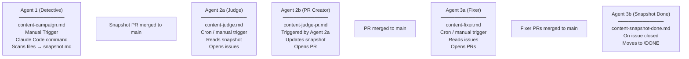

# ContentHawk - Agentic Content Audit Pipeline

ContentHawk is a multi-agent pipeline that automatically scans, judges, and fixes content in the SSW.Rules repository. It uses GitHub Actions agentic workflows to coordinate a chain of AI agents that discover outdated or problematic content, open issues, and submit pull requests with fixes.

## Pipeline Overview



## Agents

### Agent 1 - Detective

**Files:** `/.github/workflows/content-campaign.md` (GitHub Actions) and `/.claude/commands/content-campaign.md` (Claude Code slash command)

**Trigger:** Manual via GitHub Actions `workflow_dispatch` or Claude Code slash command `/content-campaign`

**Engine:** GitHub Copilot (gpt-5-mini) with Tavily MCP for web search (workflow), or Claude Code (slash command)

The entry point of the pipeline. A human operator provides:

| Input | Description |
|-------|-------------|
| Search Scope | Which content files to scan (e.g. ".NET rules that are not archived") |
| Processing Priority | Sort order for the file list |
| Intent | What downstream agents should look for (e.g. "archive all legacy rules") |
| Issue Preferences | How Agent 2a should create issues |
| PR Preferences | How Agent 3a should bundle PRs |
| Label Name | A kebab-case GitHub label slug to tie the pipeline together |

**What it does:**

1. Guards that the label does not already exist (avoids duplicate pipelines)
2. Creates the GitHub label with the intent as its description
3. Scans content files matching the search scope
4. Filters by relevance to the intent (uses web search if needed)
5. Extracts metadata (categories, created/updated dates) and sorts by priority
6. Writes a snapshot tracking file to `.github/ContentHawk/TODO/<date>_Snapshot_<label>.md`
7. Opens a PR with the snapshot on a `ContentHawk/TODO/<label>` branch

**Output:** A snapshot file containing an Agent Configuration table and a Files to Review table with every matched file marked as `pending`.

**Lock file:** `content-campaign.lock.yml` wraps the workflow to ensure it runs sequentially.

---

### Agent 2a - Judge (`/.github/workflows/content-judge.md`)

**Trigger:** Cron or manual `workflow_dispatch`

**Engine:** GitHub Copilot (gpt-5-mini) with Tavily MCP for web search

Picks up the oldest snapshot from the TODO folder and evaluates each pending file against the intent.

**What it does:**

1. Discovers the oldest snapshot in `.github/ContentHawk/TODO/`
2. Parses the snapshot for intent, label, issue preferences, and pending files
3. Guards against duplicate work — exits if an open PR with `gh-aw-workflow-id: content-judge-pr` exists for the label
4. Checks issue headroom — exits if 30+ open issues already exist for the label
5. For each pending file:
   - Reads the file content
   - Judges whether it needs action based on the intent (uses Tavily web search for external context)
   - Opens a labeled GitHub issue if action is needed, or logs it as skipped
6. Triggers Agent 2b via `workflow_dispatch` in its post-step

**Guards:**
- In-flight Judge PR check (avoids duplicate snapshot updates)
- Open issue limit (max 30 per label)
- Concurrency group `contenthawk-judge` (no parallel runs)

**Lock file:** `content-judge.lock.yml` wraps this workflow to ensure it runs sequentially.

---

### Agent 2b - PR Creator (`/.github/workflows/content-judge-pr.md`)

**Trigger:** `workflow_dispatch` from Agent 2a's post-step

**Engine:** GitHub Copilot (gpt-5-mini)

Updates the snapshot file with the results of Agent 2a's judging.

**Inputs (from Agent 2a):**

| Input | Description |
|-------|-------------|
| `snapshot_path` | Path to the snapshot file on main |
| `label_name` | The label slug for this pipeline run |
| `judge_run_id` | The Agent 2a workflow run ID |

**What it does:**

1. Guards against duplicate PRs using the reusable `guard-open-pr` action
2. Downloads the skipped files artifact from the Agent 2a run
3. Reads the snapshot and parses the Files to Review table
4. Searches GitHub for issues created by the judge run (matched via `contenthawk-run-id` in issue bodies)
5. Updates snapshot rows: `pending` -> `Issue #<number>` or `skipped`
6. Opens a PR on branch `ContentHawk/judge/<label>` with the updated snapshot

**Lock file:** `content-judge-pr.lock.yml` wraps this workflow to ensure it runs sequentially.

---

### Agent 3a - Fixer (`/.github/workflows/content-fixer.md`)

**Trigger:** Cron or manual `workflow_dispatch`

**Engine:** GitHub Copilot (gpt-5-mini) with Tavily MCP for web search

Reads open issues for a snapshot's label and applies content fixes.

**What it does:**

1. Discovers the oldest snapshot in `.github/ContentHawk/TODO/`
2. Parses the snapshot for intent, PR preferences, and label
3. Fetches all open issues with the label
4. Deduplicates — excludes issues already claimed by existing open fixer PRs
5. Bundles eligible issues according to PR Preferences (default: 5 per PR, grouped by file path similarity)
6. For each bundle:
   - Creates a branch `ContentHawk/fixer/<label>/<index>`
   - Reads each file, applies the fix based on the intent and issue suggestions
   - Uses Tavily web search when external context is needed
   - Commits changes and opens a labeled PR with `Closes #<number>` references

**Guards:**
- Deduplication against existing open fixer PRs
- Concurrency group `contenthawk-fixer` (no parallel runs)
- Max 5 PRs per run (safe-output limit)

**Lock file:** `content-fixer.lock.yml` wraps this workflow to ensure it runs sequentially.

---

### Agent 3b - Snapshot Done (`/.github/workflows/content-snapshot-done.md`)

**Trigger:** Issue closed with `gh-aw-workflow-id: content-judge` in the body

**Engine:** GitHub Copilot (gpt-5-mini)

Checks whether a snapshot is fully complete when a ContentHawk judge issue is closed.

**What it does:**

1. Fires when any ContentHawk judge issue is closed (guarded by body marker check)
2. Reads the closed issue's labels to find the matching snapshot in `TODO/`
3. Parses the Files to Review table — checks no rows are `pending`
4. Uses GitHub tools to verify all referenced `Issue #N` entries are closed
5. Opens a PR to move the snapshot from `TODO/` to `DONE/`

**Guards:**
- Pre-step checks for `gh-aw-workflow-id: content-judge` in the issue body
- Exits early if pending rows remain or any referenced issue is still open
- Concurrency group `contenthawk-snapshot-done` (no parallel runs)

**Lock file:** `content-snapshot-done.lock.yml` wraps this workflow to ensure it runs sequentially.

---

## How to Trigger

| Agent | How to trigger | Notes |
|-------|---------------|-------|
| Agent 1 (Detective) | Run `/content-campaign` in Claude Code **or** dispatch `content-campaign.lock.yml` from GitHub Actions with all 6 inputs | Requires a unique label name that doesn't already exist |
| Agent 2a (Judge) | Runs automatically on cron, or dispatch `content-judge.lock.yml` manually | Picks up the oldest TODO snapshot automatically |
| Agent 2b (PR Creator) | Triggered automatically by Agent 2a's post-step | Do not trigger manually — requires artifacts from Agent 2a |
| Agent 3a (Fixer) | Runs automatically on cron, or dispatch `content-fixer.lock.yml` manually | Picks up the oldest TODO snapshot automatically |
| Agent 3b (Snapshot Done) | Triggered automatically when a ContentHawk issue is closed | No manual trigger needed |

## Snapshot Lifecycle

```
TODO/                          DONE/
 |                              |
 +- 2026-03-01_Snapshot_X.md   +- 2026-02-15_Snapshot_Y.md
 |   (pending rows remain)      |   (all rows processed)
 |                              |
 +- Agents 2a/2b/3a process -> +- Agent 3b moves here
```

Snapshots flow through these states:

| State | Location | Description |
|-------|----------|-------------|
| Created | PR branch | Agent 1 creates and opens a PR |
| Active | `TODO/` on `main` | PR merged, agents 2a/2b/3a process it |
| Complete | `DONE/` on `main` | All rows processed, Agent 3b moves it via PR |

## Shared Infrastructure

### Labels

Each pipeline run is tied together by a single GitHub label (e.g. `archive-legacy-rules`). Every issue and PR created by the pipeline carries this label, enabling:

- Issue counting and headroom checks
- Deduplication of fixer PRs
- Filtering in GitHub's UI

### Guard Action (`.github/actions/guard-open-pr/`)

A reusable composite action that fails a workflow if an open PR already exists with a given label and `gh-aw-workflow-id` marker in its body. Used by Agent 2b and checked by Agent 2a to prevent duplicate work.

### Lock Files

Each agentic workflow has a corresponding `.lock.yml` wrapper that ensures sequential execution. Always dispatch the lock file (e.g. `content-judge.lock.yml`) rather than the `.md` workflow directly.

### Concurrency Groups

| Group | Workflow | Behavior |
|-------|----------|----------|
| `contenthawk-judge` | Agent 2a | No parallel runs, no cancellation |
| `contenthawk-judge-pr-<label>` | Agent 2b | Per-label, no cancellation |
| `contenthawk-fixer` | Agent 3a | No parallel runs, no cancellation |
| `contenthawk-snapshot-done` | Agent 3b | No parallel runs, no cancellation |

### MCP Tools

| Tool | Used by | Purpose |
|------|---------|---------|
| Tavily Search | Agents 1, 2a, 3a | Web search for external context during scanning/judging/fixing |
| `list-snapshots` MCP script | Agents 2a, 3a | Lists snapshot files in TODO folder, sorted oldest-first |

## File Structure

```
.github/
├── ContentHawk/
│   ├── TODO/                              # Active snapshots
│   │   └── YYYY-MM-DD_Snapshot_<label>.md
│   ├── DONE/                              # Completed snapshots
│   │   └── YYYY-MM-DD_Snapshot_<label>.md
│   └── README.md                          # This file
├── actions/
│   └── guard-open-pr/
│       └── action.yml                     # Reusable duplicate-PR guard
└── workflows/
    ├── content-campaign.md                # Agent 1 (Detective)
    ├── content-campaign.lock.yml          # Lock wrapper for Agent 1
    ├── content-judge.md                   # Agent 2a (Judge)
    ├── content-judge.lock.yml             # Lock wrapper for Agent 2a
    ├── content-judge-pr.md                # Agent 2b (PR Creator)
    ├── content-judge-pr.lock.yml          # Lock wrapper for Agent 2b
    ├── content-fixer.md                   # Agent 3a (Fixer)
    ├── content-fixer.lock.yml             # Lock wrapper for Agent 3a
    ├── content-snapshot-done.md           # Agent 3b (Snapshot Done)
    ├── content-snapshot-done.lock.yml     # Lock wrapper for Agent 3b
    ├── mcp-scripts/                       # MCP script definitions
    └── mcp-config/                        # MCP server configuration
.claude/
└── commands/
    └── content-campaign.md                # Agent 1 (Detective) slash command
```
