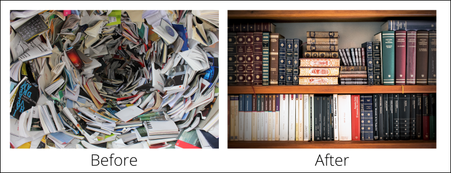

According to [Statista](https://www.statista.com/statistics/456500/daily-number-of-e-mails-worldwide/), 333.2 billion emails are sent per day in 2022. That's a lot of emails, and they can pile up fast - which is why it's so important to keep your inbox under control. Emails are legal documents and should be treated with the same care as any other correspondence with clients or employees. You should endeavour to keep your inbox as a to-do list only and know how to file or delete emails as necessary so that your inbox reflects an accurate record of requests, conversations, and decisions.

Just as...

