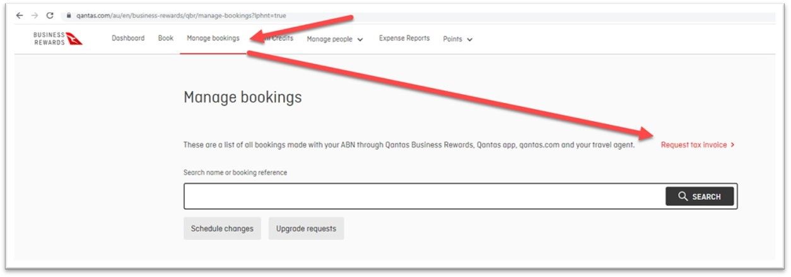

### Do you know how to manage Qantas bookings?

SSW encourage our staff to book their flight on Qantas because of its safety, reliability, environmental sustainability and reputation.

Qantas offers a robust loyalty program, which can provide benefits to both the individual traveler and the company. Companies can accumulate points and rewards through the program that can be used to offset future travel expenses.

* All flights booked by the company can be managed through Qantas Business Reward https://www.qantas.com/au/en/business-rewards/qbr/myaccount
* There is a monthly report which can be downloaded via https://www.qantas.com/au/en/business-rewards/qbr/reports	

If an invoice is missing, admins with access the document by

1. Go to Qantas Business Reward | Management Booking | Request tax invoice
2. Tick “e-Ticket”, and enter the booking reference which can be found on monthly reports or confirmation emails.
3. Tax invoice will be sent to the email entered. 

::: greybox
***NOTE***: Only the booking made by SSW Qantas account can be found on Qantas Business Reward.
:::