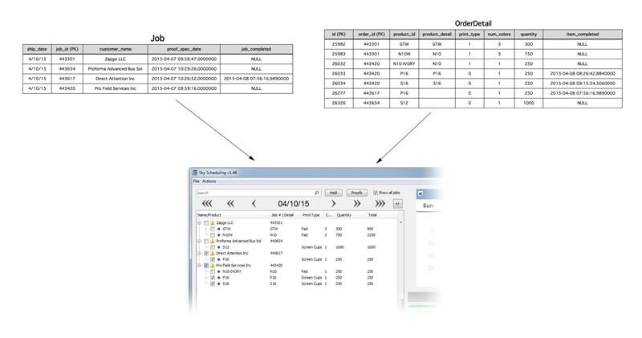

The deployment of your schema is critical to your application. You should never get an error message reported from a user like:

> "When I click the Save button on the product form it gives an ❌ error message about a missing field."

Bottom line is the customers' database schema should always be correct, should be managed automatically by the app and if it is not, you’re doing things wrong.

Use our great modern tools properly, and a schema problem will never bite you. 

