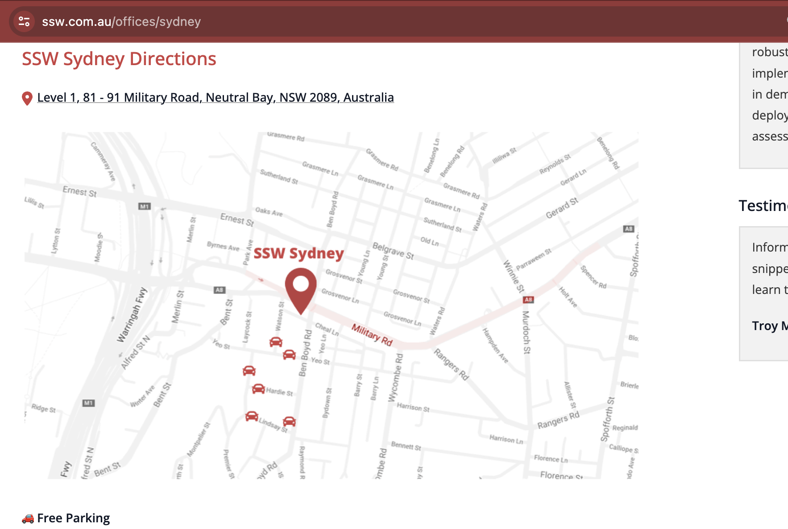

Sometimes you send an email and get a response saying it's too cryptic. Never assume that others will understand you. When sending an email it's very important to add context and reasoning, and make yourself as clear as possible. This way anyone can understand your content at any time in the future.

<!--endintro-->

It starts with a [good email subject](/good-email-subject).

Nearly every email can be enhanced by including a screenshot and a URL. Provide extra clear information by [adding links](/include-links-in-emails) and [useful captions on screenshots](/add-useful-and-concise-figure-captions).

Also make sure to always [keep the history of an email](/keep-email-history), so there are enough details in the thread for anyone else to acknowledge what is going on.

::: email-template

| | |
| -------- | --- |
| To: | Dave |
| Subject: | Map link |
::: email-content

### Hi Dave

I've added the map link

:::
:::
::: bad
Figure: Bad example - There is no context or reasoning
:::

::: email-template

| | |
| -------- | --- |
| To: | Dave |
| Subject: | SSW.Website - Office page - Add link to address |
::: email-content

### Hi Dave

ssw.com.au/offices/sydney

As per our conversation, I have included the Google Maps URL for the office address.
This will facilitate clients and event attendees in finding their way to the office.

:::
:::
::: good
Figure: Good example - There is both context and reasoning
:::

### What if you receive a cryptic email?

The most productive way to understand a confusing email is to [seek clarification with a call](/seek-clarification-via-phone).

**Video:** [Top 10+ Rules to Better Email Communication with Ulysses Maclaren](https://www.youtube.com/watch?v=LAqRokqq4jI)
