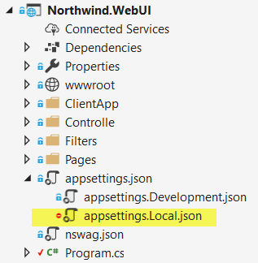
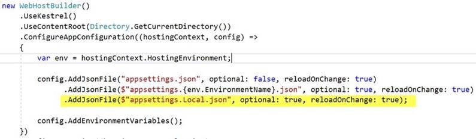

With .NET Core, we've got a new, extensible configuration system for our projects. This is easily extended and has out-of-the-box support for many configuration sources including JSON files, per-environment overrides, command-line parameters, and environment variables.

A common source of pain when working in a team is when different team members require different connection strings in order to run the project locally. If the developer modifies settings and then accidentally pushes that change into source control, the app might break for other developers.

<!--endintro-->

Resolve this by:

Now, any new developer that needs a custom connection string (or any other configuration setting) can create their own appsettings.Local.json file without affecting any other team member’s configuration.
