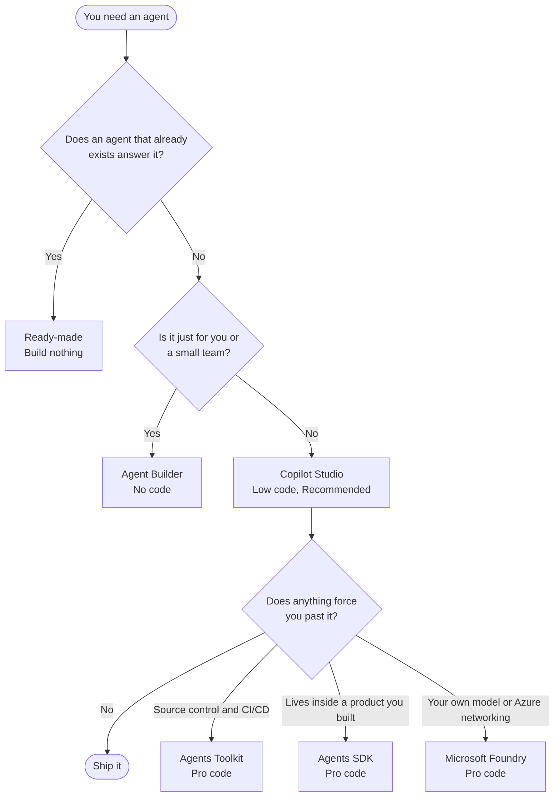

---
authors:
  - title: Luke Mao
    url: https://www.ssw.com.au/people/luke-mao
created: 2026-09-09T00:00:00.000Z
createdBy: Luke Mao
createdByEmail: LukeMao@ssw.com.au
guid: 88c76a84-da63-466b-b749-2a3092d479d6
isArchived: false
lastUpdated: 2026-09-09T00:00:00.000Z
lastUpdatedBy: Luke Mao
lastUpdatedByEmail: LukeMao@ssw.com.au
redirects:
  - bot-framework
related:
  - rule: public/uploads/rules/dataverse-ai-options/rule.mdx
  - rule: public/uploads/rules/website-chatbot/rule.mdx
seoDescription: Ready-made, no-code, low-code, and pro-code. Compare Agent Builder,
  Copilot Studio, the Agents Toolkit, the Microsoft 365 Agents SDK, and Microsoft Foundry
  to pick the right platform for your chatbot or AI agent.
title: Do you choose the right platform for your AI agent?
categories:
  - category: categories/software-engineering/rules-to-better-bots.mdx
type: rule
uri: ai-agent-platform
---

You need an agent that answers staff questions from the HR policies in SharePoint. You open a studio, wire up knowledge sources, and ship it a fortnight later.

That site already had an agent. Every SharePoint site does, scoped to exactly that content, on day one.

Microsoft offers four tiers, and most teams start further down than they need to.

<endIntro />

## Which one should you use?

Four tiers, from an agent that already exists to one you host yourself.

| Tier | Tool | Publishes to |
| --- | --- | --- |
| Ready-made | Every site's built-in agent, the Agent Store, and the Word, Excel, and PowerPoint agents | Wherever that app already is |
| No-code | Agent Builder | Microsoft 365 Copilot, Teams |
| Low-code | Copilot Studio (Recommended) | Teams, web, WhatsApp, Slack, SMS, and more |
| Pro-code | Agents Toolkit | Microsoft 365 Copilot, Teams |
| Pro-code | Microsoft 365 Agents SDK | Any surface you code |
| Pro-code | Microsoft Foundry | Teams, Microsoft 365 Copilot, or any app via its endpoint |

Work down the tree and stop at the first thing that fits.

Most teams should stop at Copilot Studio. The common failure is not picking a weak tool, it is reaching for a powerful one before anyone has proven the agent gets used.

<boxEmbed style="info" figurePrefix="none" figure="" body={<>

**Note:** A [SharePoint agent](https://learn.microsoft.com/en-us/sharepoint/get-started-sharepoint-agents) is not a separate platform. It is a no-code agent authored inside SharePoint and scoped to that site, on the same orchestrator Agent Builder uses. Author it there when the content is one site and you want the site owner to keep it. Agent Builder covers the same SharePoint content plus OneDrive, Teams chats, and email.

</>} />

## Why is Copilot Studio the default?

Because it is a finished product rather than a toolkit. [Knowledge](https://learn.microsoft.com/en-us/microsoft-copilot-studio/knowledge-copilot-studio) from SharePoint, Dataverse, documents, and Microsoft Search connectors without code. Generative answers on by default. Per-user security trimming, so each person only sees content their Entra ID account can already open. File uploads, a [long list of channels](https://learn.microsoft.com/en-us/microsoft-copilot-studio/publication-fundamentals-publish-channels), and real dev, test, and production environments.

Reach and governance decide this, not features. Choose it when the agent serves a department, the organisation, or customers, or when it has to survive an audit.

## Why is the Agents SDK not a peer?

It is the successor to Bot Framework, which Microsoft retired in December 2025, and it inherits that job: move messages between a user and whatever logic you wrote. [Microsoft is blunt](https://learn.microsoft.com/en-us/microsoft-365/agents-sdk/agents-sdk-overview) that it is not an AI model, not an orchestration engine, and not a no-code builder.

Picking it instead of Copilot Studio means building generative answers, grounding, and security trimming yourself. It ships a [Copilot Studio client](https://learn.microsoft.com/en-us/microsoft-365/agents-sdk/integrate-with-mcs) for .NET, JavaScript, and Python, so put Copilot Studio or Foundry behind it rather than in place of them.

<boxEmbed style="warning" figurePrefix="none" figure="" body={<>

**Warning:** Foundry is closer to Copilot Studio than the names suggest, using the same Microsoft 365 retrieval stack and the same permission trimming. Two catches: its [SharePoint tool](https://learn.microsoft.com/en-us/azure/foundry/agents/how-to/tools/sharepoint) stops working once the agent is published to Teams, and every end user needs a Microsoft 365 Copilot licence.

</>} />

## What if you are not a Microsoft shop?

Grounding and per-user permission trimming only work where your content and your identity provider already live, so the platform follows the data.

| Your content mostly lives in | Look at |
| --- | --- |
| Microsoft 365, SharePoint, Dataverse | Copilot Studio |
| Google Workspace or Google Cloud | Gemini Enterprise Agent Platform |
| AWS | Amazon Bedrock AgentCore |
| Salesforce | Agentforce |
| Nowhere in particular | A code-first SDK such as the OpenAI Agents SDK or LangGraph |

<boxEmbed style="info" figurePrefix="none" figure="" body={<>

**Note:** Choose for where your data lives, not for the authoring experience. OpenAI shipped a visual Agent Builder in October 2025 and [deprecated it eight months later](https://developers.openai.com/api/docs/deprecations), with shutdown set for 30 November 2026. Drag-and-drop canvases come and go. The grounding layer is what you are really committing to.

</>} />

***

### Learn more

* [Choose between Agent Builder and Copilot Studio](https://learn.microsoft.com/en-us/microsoft-365/copilot/extensibility/copilot-studio-experience) - Microsoft's decision tree, by audience and scope
* [Choose the right tool to build a declarative agent](https://learn.microsoft.com/en-us/microsoft-365/copilot/extensibility/declarative-agent-tool-comparison) - pros and cons of all four declarative tools
* [SSW: Do you know your Dataverse AI options?](/dataverse-ai-options) - Copilot Studio agents and MCP against Dataverse
