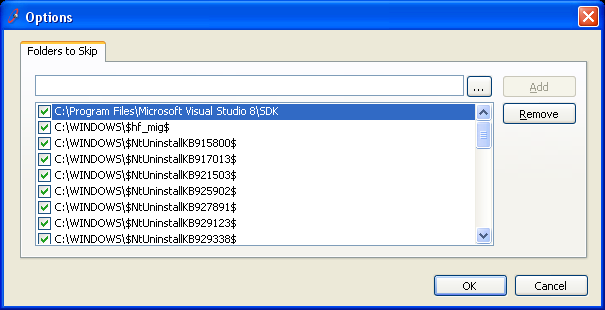
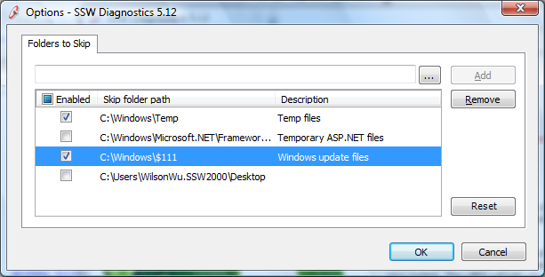

Always choose a GridView (over a ListBox) because it can have:

<!--endintro-->

1. Multiple columns
2. Checkboxes in the header of the control, which enables users to easily check or uncheck all items
3. Add sub-controls added such as buttons, links, charts, and even customized controls to the Gridview. This means you get unlimited flexibility with the GridView

::: bad

:::

::: good

:::
