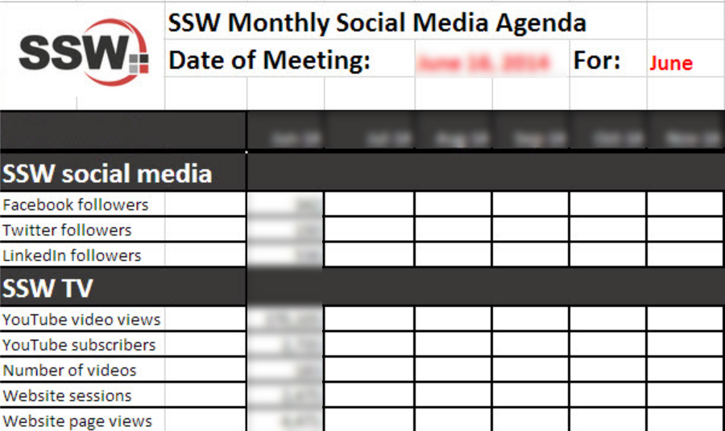
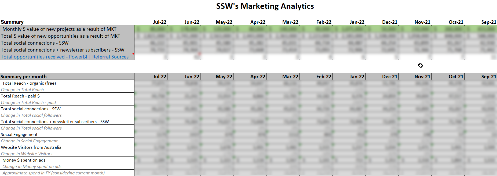

**Analyzing your results (click-throughs, engagement, and new followers, for example) lets you see what was successful and what people have engaged with the most.**

This helps you further streamline your content and provides an insight into trends and areas of growth. Remember, Marketing is an iterative process - the more you reflect, the better you can tailor your content and allocate your time and resources to a campaign that is delivering results.

<!--endintro-->

1. First, you have to identify all your marketing efforts - E.g. website, social media, blog, newsletter, events and chatbot.
2. When you think of each marketing effort, try to think of what you are trying to achieve with that activity. For example, if you share a newsletter every month, what are you trying to get from it? Inquiries? Sales? Set a goal for them and follow up. This will help you identify which channel is working the most, even further, and what efforts are worth keeping. You will be able to identify if, for example, your audience is not on a specific social media you thought you would perform well.
3. The next step is to make sure your pixels, conversion codes, etc. are working properly.
4. After this, create a spreadsheet that you can update every month to keep track of your marketing activities.
5. Present this to your manager and your marketing team to encourage discussions and improvements. A quarterly marketing meeting would be ideal to look back and see what went well, and what didn’t go as expected. See [our tips for good presentations](/rules-to-better-powerpoint-presentations).\
   During this meeting, you can discuss:

* Marketing activities you worked on
* Results (highlight key results)
* Plan for next month, including budget and tactics

6. After the meeting, send an email with what was discussed, what you worked on, and what results you have achieved. Of course, don’t forget to include the approved budget.
7. Keep this information in a report-style document stored on your Intranet so that you can look back to compare results.

::: bad

:::

::: good

:::
