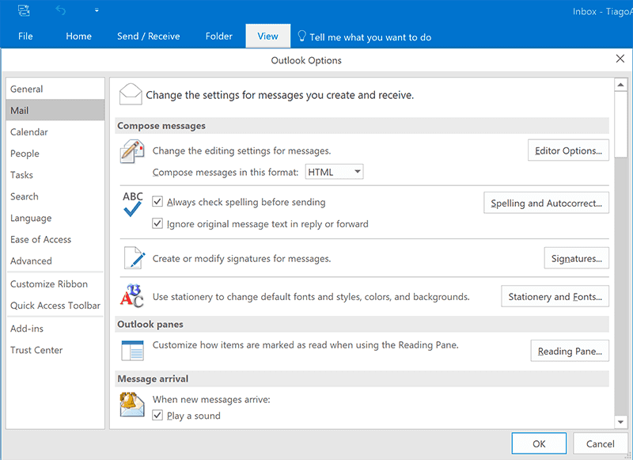
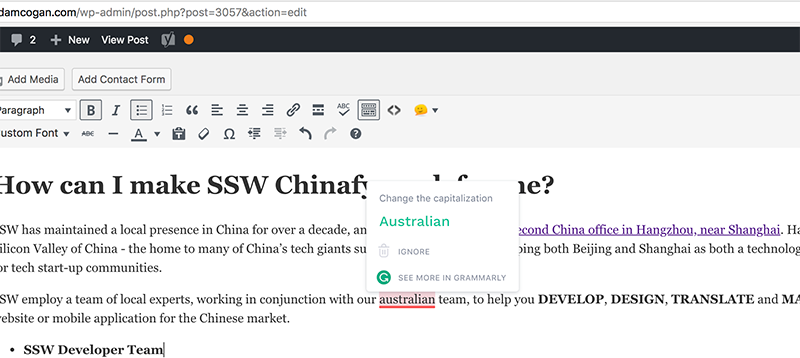
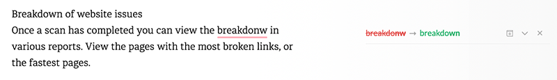
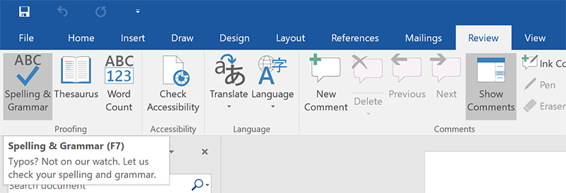
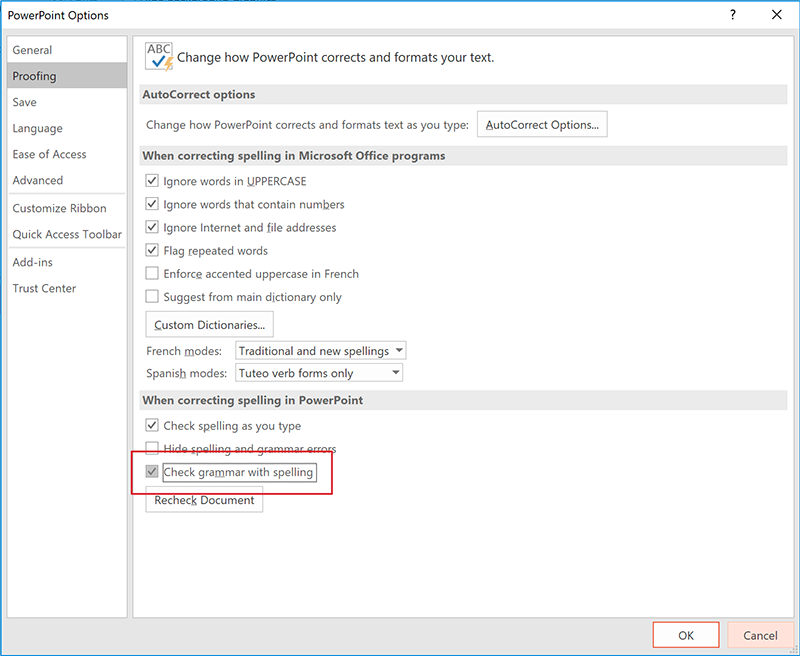

Improper spelling, grammar, and punctuation gives a bad impression of your company and can result in your message not being conveyed correctly.

<!--endintro-->

## Emails

Emails with no full stops or commas are difficult to read and can sometimes even change the meaning of the text. And, if your program has a spelling checking option, why not use it?

To ensure this doesn't happen, use Microsoft Outlook Spelling & Grammar Checker on the 'Editor Options' window.

## Web content

When on a web page, [install Grammarly Addon for Chrome](https://chrome.google.com/webstore/detail/grammarly-for-chrome/kbfnbcaeplbcioakkpcpgfkobkghlhen) so you can automatically check web content. For example, while editing in a CMS.

Any other text can be checked manually. Go to [Grammarly](https://app.grammarly.com), create a New Document and Paste your content to check your text.

## Documents

On Word, press **F7** (or on the ribbon go to **Review &gt; Spelling & Grammar** ) to check your .docx text.

## Presentations

On PowerPoint, press **F7** (or on the ribbon go to **Review | Spelling & Grammar** ) to check your .pptx text.

You should also keep "Check grammar with spelling" checked in your PowerPoint **Options | Proofing**:

