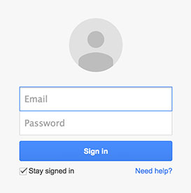

When you present visitors to your site with an opportunity to sign in, you should always include an option to have that person signed in automatically.

<!--endintro-->

::: good  
  
:::

This should be implemented simply by using a checkbox. A cookie should be stored on the user's computer so that next time they visit your site the sign in process is automatic.
