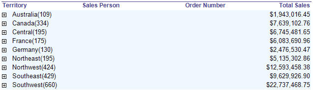
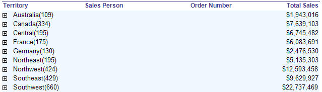
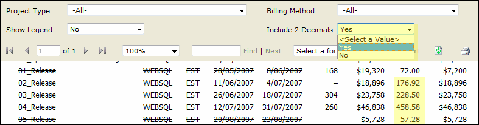

Having decimal places is generally not required when the numbers are there to show a general indication.
<!--endintro-->

Only include decimal places on reports for accountants that will be used for reconcilations.

::: bad  
  
:::

::: good  

:::

Here's how to remove decimal place in your report:

In the **Expression** property of the **Textbox**, add an expression to format currency values. Use the following expression:

```sql
--Expression to remove decimal place

c0 = FormatCurrency( Sum(Fields!TotalDue.Value), 0)
```

Note: The **FormatCurrency** function is one of several native functions provided by Reporting Services and returns an expression formatted as a currency value using a currency symbol according to the language setting on the textbox.

What is some managers don't want decimals and accountants do?

For some users (usually accountants) the number is critical to accurate reporting and reconciliation. In such cases, add a parameter to let the users choose.

This workaround should not be necessary. See the suggestion to Reporting Services ?Give users a runtime option to increase or decrease decimals places, so we don't need this workaround.

::: good  

:::
