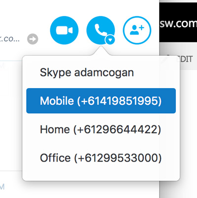

Email is great. But in an emergency, you need to pick up the phone. Often the most effective methods of communication for a project is to talk directly to colleagues and clients on the phone.

<!--endintro-->

::: bad  
  
:::

::: good  
  
:::

**Remote offices tip:** Don’t make being overseas a barrier. Of course, it is always best to provide a local number as that gives clients peace of mind and keep their costs down. Not many clients will call an international number and there are lots of options. The next best alternative is to at least show your overseas phone number.
