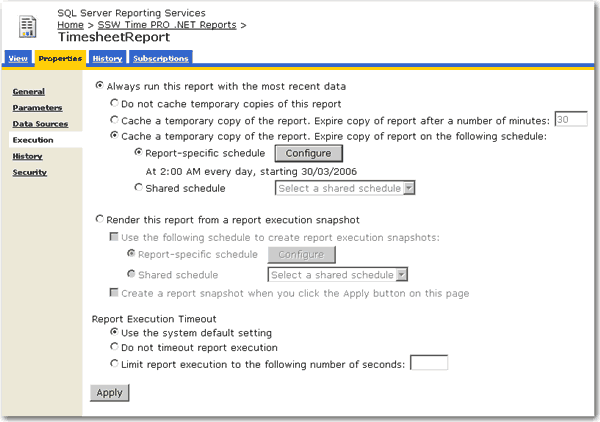

When you have a large number of users all trying to access the same reports, the performance of your report server can suffer dramatically. Caching reports for a certain period of time can drastically reduce the load placed on the report server, leaving it ready to handle other requests.

<!--endintro-->

When a report has caching enabled it only needs to be processed once within the expiry period. This means that when the first of your eager users hits that report, the report server will keep a copy until it expires, and will serve up this copy to any users that request the report within that period. This leaves the report server ready to process other reports quicker as it is not busy processing the popular reports over and over again.

For more information on setting up report caching please see the following [KB article](http://www.ssw.com.au/ssw/KB/KB.aspx?KBID=Q1668240)

