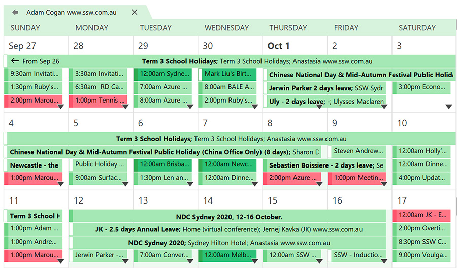

If someone has [shared their calendar permissions](/calendar-do-you-allow-full-access-to-calendar-admins) with you, you will be able to check their calendar directly without needing a conversation.

Imagine someone wants to book some time with you. Offer to look up the calendar and book in time straightaway.

<!--endintro-->

::: bad
Bad Example - "Try calling him."
:::

:::good

:::
