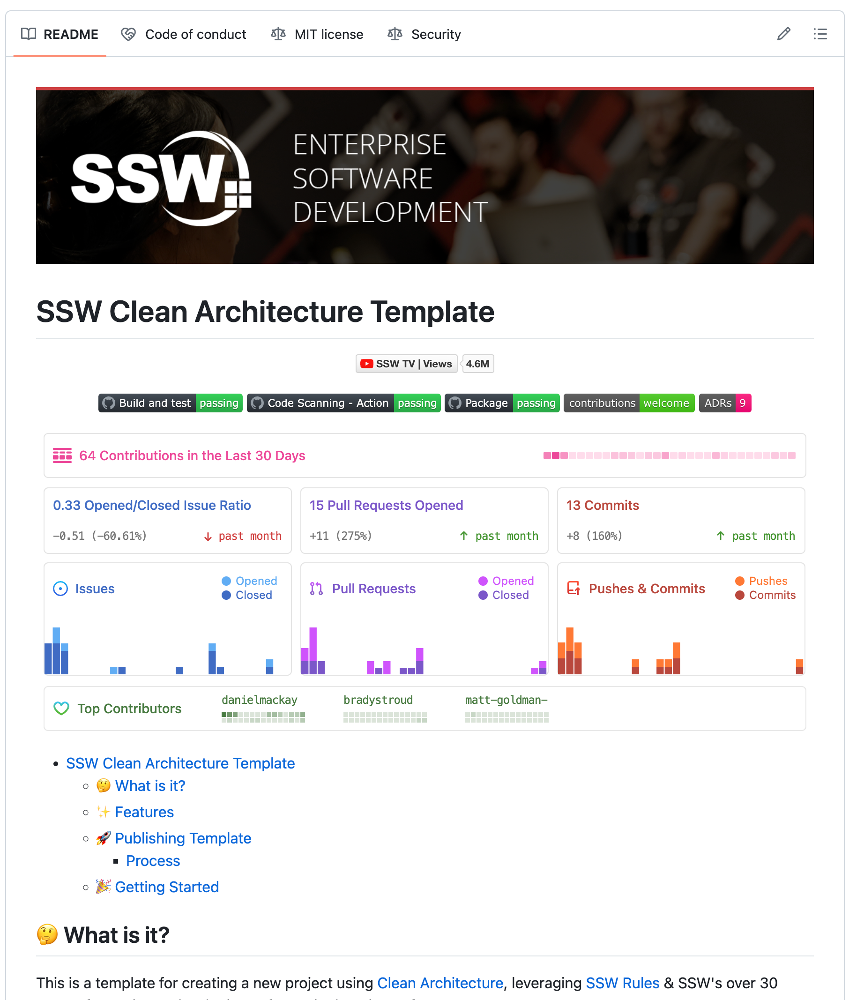

If you're building a Clean Architecture application, then the SSW Clean Architecture Template is the best way to get started.

<!--endintro-->

The template is an implementation of Clean Architecture in a .NET Web API. It includes a full implementation of CA covering testing, validation and many other topics.

To set up this template, follow the steps in the [project README | Getting Started](https://github.com/SSWConsulting/SSW.CleanArchitecture?tab=readme-ov-file#-getting-started).
