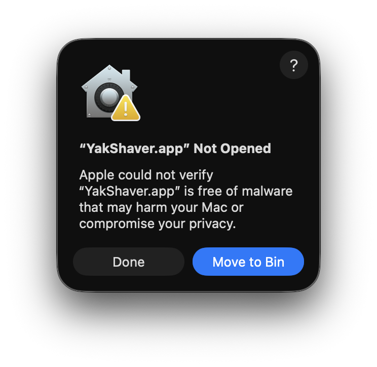
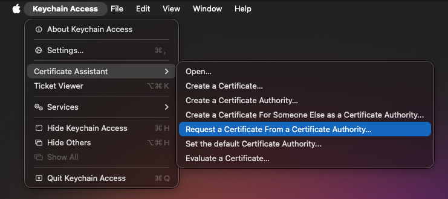
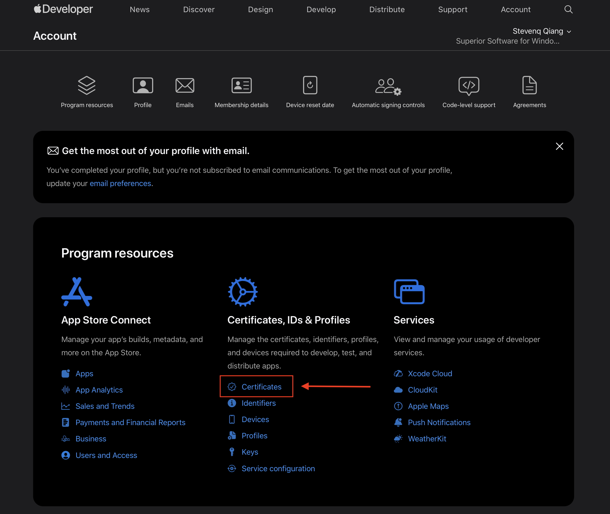
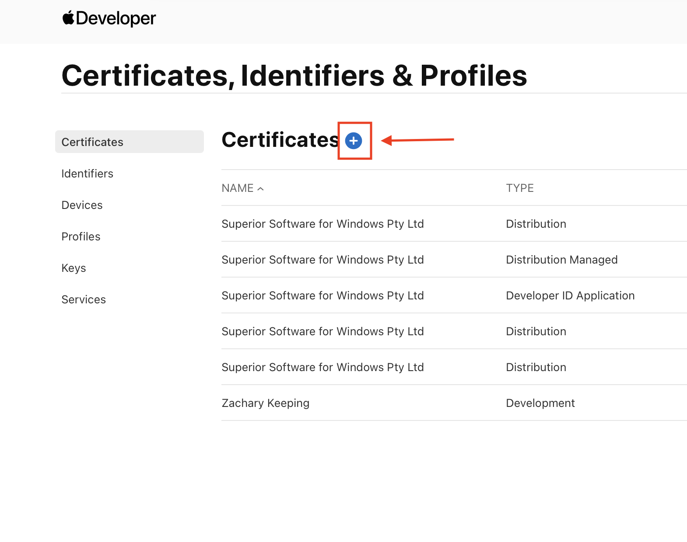
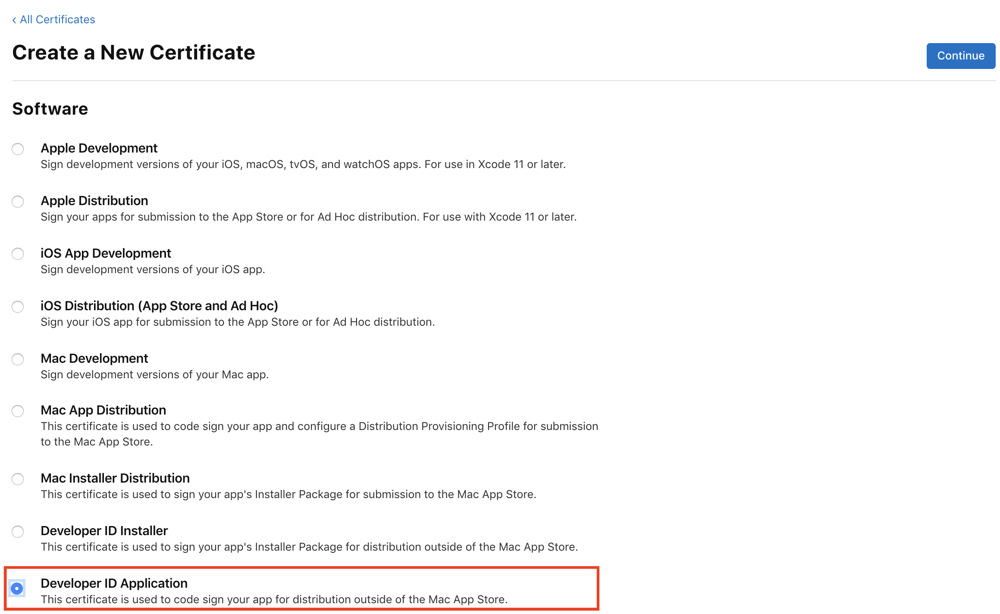
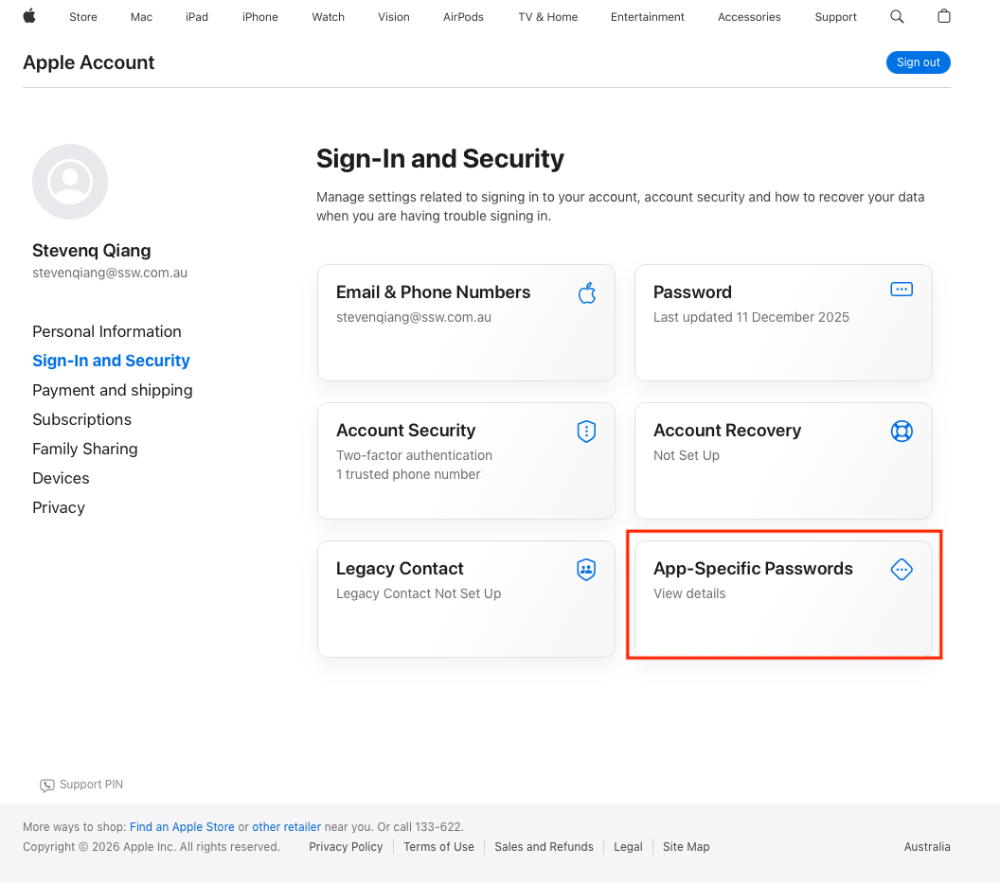
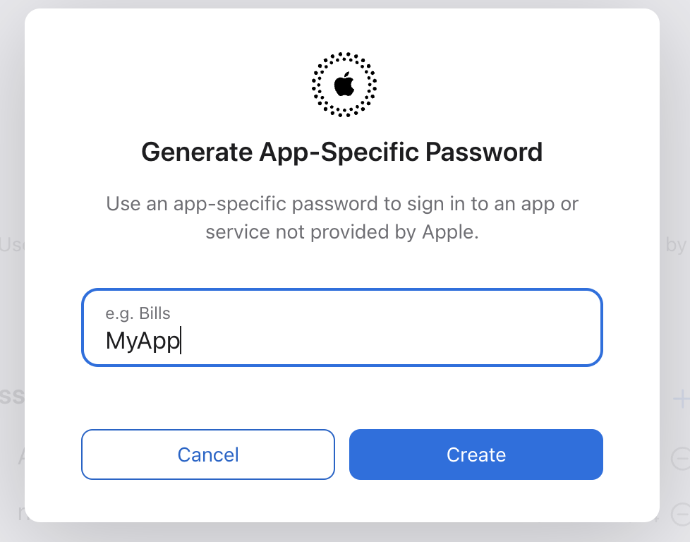
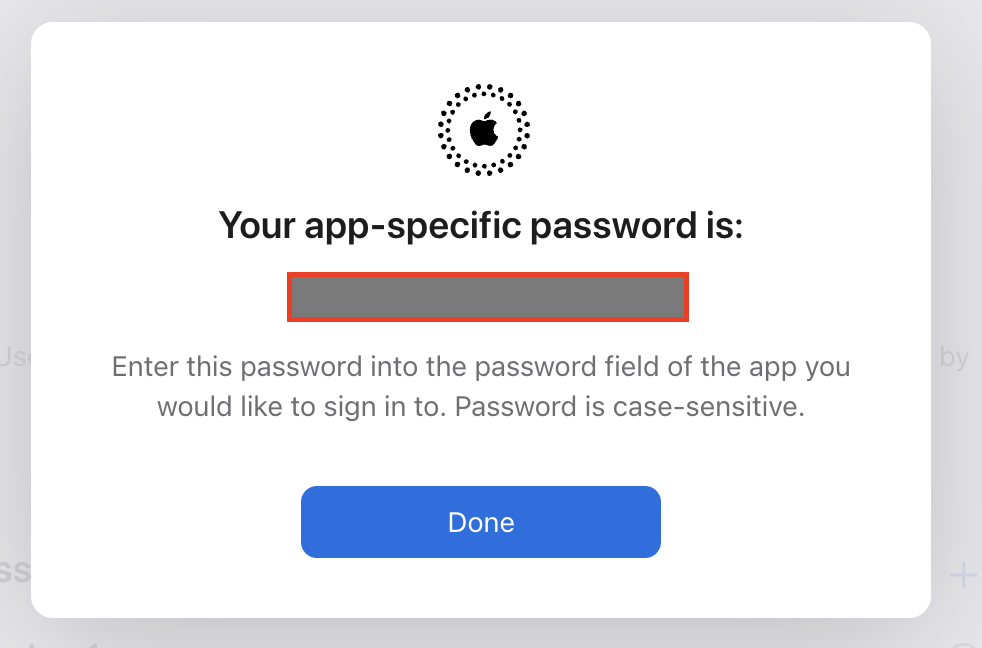

Intro

<endIntro />

# How to Code Sign and Notarize an Application for macOS

When you develop a macOS application and distribute it outside the Mac App Store, users will often see a security warning the first time they try to open it. This happens because Gatekeeper cannot identify the application’s developer, so the app is treated as untrusted. While there are workarounds to bypass Gatekeeper, they require users to go through multiple manual and advanced steps, resulting in a poor user experience.

As the title suggests, removing this system warning involves two main steps:

* **Code signing** (using a Developer ID Application certificate)
* **Notarization** (submitting the app to Apple for automated security checks)

---

## Code Signing

To code sign your application, you need to obtain a **Developer ID Application** certificate from Apple. The process starts by creating a **Certificate Signing Request (CSR)** using Keychain Access. The CSR proves ownership of a local signing key without exposing the private key itself. Apple uses this request to issue the **Developer ID Application** certificate.

### Preparation

Before you start, make sure you have:

* Asked a SysAdmin to invite your SSW account to the SSW Apple Developer Team
* A Mac with **Keychain Access.app**
* Access to the **Apple Developer Portal** using the **Account Holder’s** Apple ID (the primary Apple ID for your organization)

### Step 1: Create a Certificate Signing Request (CSR)

1. Use **Spotlight** to search for **Keychain Access**.

2. In the menu bar, select:
   **Keychain Access → Certificate Assistant → Request a Certificate From a Certificate Authority…**

   

3. Fill in the form:

   * **User Email Address** — Can be any email address (it does not need to match the Account Holder’s email)
   * **Common Name** — A descriptive name, for example: `Your App Name`
   * **CA Email Address** — Leave blank
   * **Request is** — Save to disk

   

4. Click **Continue** and save the file to your local disk.

### Step 2: Create a Developer ID Application Certificate

1. Sign in to the [Apple Developer Portal](https://developer.apple.com/account) using the **Account Holder’s** Apple ID.

2. Navigate to **Certificates, Identifiers & Profiles**, then select **Certificates**.

   

3. Click the **➕ (Add)** button to create a new certificate.

   

4. Under **Software**, select **Developer ID Application**, then click **Continue**.

   

5. When prompted, upload your CSR file:

   * Select the `.csr` file you created earlier
   * Click **Continue**

   

6. Download the certificate (`.cer`) to your Mac.

### Step 3: Export the Private Key

1. Double-click the downloaded `.cer` file on your Mac.

   * This will automatically install the certificate into **Keychain Access**.

2. Open **Keychain Access** again.

   * **Keychain:** `login`
   * **Category:** `My Certificates`

You should now see:

* **Developer ID Application: <Your Name or Company>**
* The **private key** nested under it

🎉 **Congratulations!** You now have a **Developer ID Application** certificate ready for code signing.

---

## Notarization

Notarization is the process where Apple reviews a signed macOS application before it is distributed. The app is submitted to Apple’s notarization service, where it is automatically scanned for malicious content and common security issues. Once approved, macOS can verify that Apple has reviewed the app, allowing Gatekeeper to open it without security warnings.

### Setps:
1. Sign in to [Apple Account](appleid.apple.com) (Your own work Apple Account. e.g YourName@ssw.com.au)

2. In the Sign-In and Security section, select App-Specific Passwords.

   

3. Select Generate an app-specific password or select the Add button(+).

   

4. Then give a name for the password and click `Create`.

   

A new App-Specific Password will be generated. Save it in a safe place.

🎉 **Congratulations!** Now you should have these information for notarizing your macOS application.
   - Apple_Team_ID: [Apple Developer Portal](developer.apple.com) | Account | Membership
   - Apple_ID: YourName@ssw.com.au
   - Apple_APP_SPECIFIC_PASSWORD: the password you have just created

