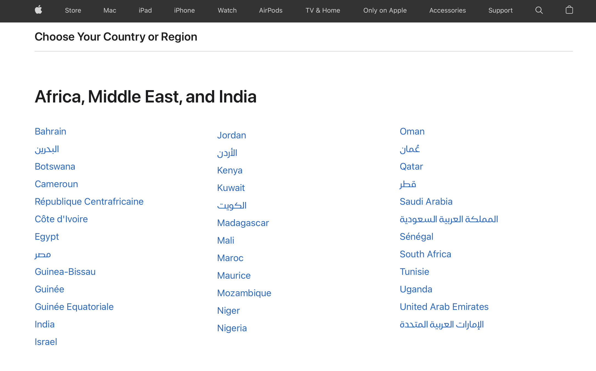

The search direction of a list should be obvious. When it comes to a multicolumn list, you should always head down instead of across for legibility.

Vertical lists are much easier to scan than horizontal lists, because all items are aligned to left, when you're looking for an item, you don't need to read the entire word, you can quickly scan the first letters and get directly to the item you look for.

<!--endintro-->

::: good

:::
