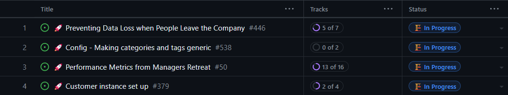
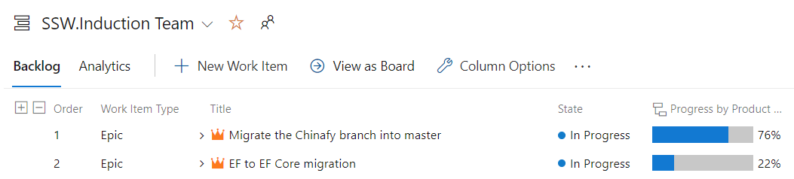
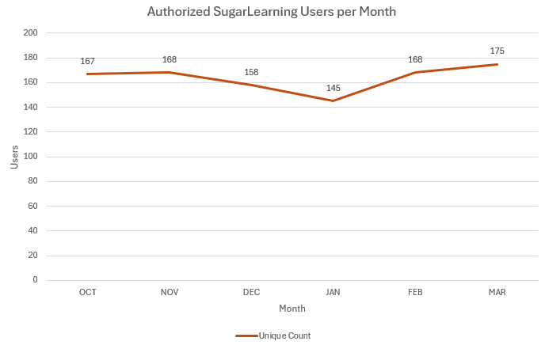
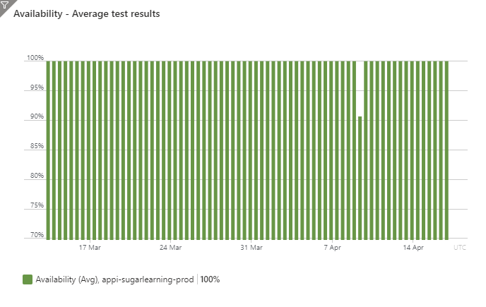

As a Product Owner, you are representing the product's stakeholders on the Scrum Team. You will be a representative of the product to other people in your business, such as your manager. You will often be asked the question "How is your product going?"

<!--endintro-->

A good way of keeping stakeholders informed of progress is holding monthly meetings.

## Monthly meeting agenda

To prepare for meetings and maximise the chances of success for your project, ensure you have answers to the following questions:

1. **Value - What features have been delivered recently?** Celebrate your successes and demonstrate how your product is adding value to stakeholders. Examples could include:

   * A new login screen with better accessibility for visually impaired users
   * A shortened user registration process
   * Support for a new business process

   ::: info
   **Tip:** If you [record your Sprint meetings](/summary-recording-sprint-reviews), you can ask the stakeholders if they would like to review them.
   :::

2. **Development - How has the Roadmap progressed?** Explain how the completion of certain PBIs contributed to achieving the aim of the Product Roadmap. For example:

   * Internationalization epic - Added Mandarin translations for an Angular component
   * Subscription epic - Added payment processing

   ::: info
   **Tip**: Software such as [GitHub Projects](https://docs.github.com/en/issues/planning-and-tracking-with-projects/learning-about-projects/about-projects) and [Azure DevOps](https://azure.microsoft.com/en-au/products/devops?WT.mc_id=AZ-MVP-33518) can be used to graphically demonstrate progress.
   :::

   

   

3. **Development - What delays or blockers have been encountered while writing the software?** [Software development is painful and costly](/do-you-manage-clients-expectations/). Explain the difficulties that the project has encountered, and detail your plan to overcome those difficulties. For example:

   * The upgrade between Angular versions has been slower than expected. We have booked in an expert to assist the team
   * The new customer registration process was taking longer than expected to implement - the original prediction was 4 effort points, and is now expected to take 16 (and has 14 remaining). Originally it was going to be 3 screens, and is now 5 screens

4. **Operations - How do the product's metrics compare historically?** If you have responsibility for the operation of your product, you need to be tracking metrics such as the number of users accessing the system or how many hours they are spending on your site. Provide graphs to demonstrate trends. For example:

   * Have a graph demonstrating how the user count has changed over the last 6 months

   

5. **Health - What issues have been seen in Production?** [All errors should be logged](/do-you-log-every-error/), so you should be able to list:

   * Visible errors - errors that impact the User eXperience (UX) negatively
   * Invisible errors e.g. unhandled exceptions, unexpected SQL log messages
   * Performance issues

   All such issues should have plans for investigation or rectification. For example:

   * ✅ DONE - The frontend experienced an increase in errors when adding new users to the system. This was tracked to a bug in how data is being serialized from the backend, and was fixed last Sprint
   * TODO - Since upgrading the database server version, a significant increase of 2 seconds in server response time has been seen. System Administrators are investigating

6. **Planning - What decisions have been made regarding the project?** As Product Owner, you will be approving changes to the behaviour of the product and many of these changes will be in development. Explain the decisions that you've made and their rationale. Try to catch misalignments in stakeholder views before your decisions are coded. For example:

   * I have modified the permissions model for the website to allow contributing users access to unpublished articles, as they often request input from each other
   * I approved the mock-ups for the website redesign, as they were cleaner and easier to understand than the current website pages

7. **Vision - Are we still happy with the Product Goal?** Circumstances and priorities change - in extreme circumstances, the Goal may need to be changed completely. Work with your stakeholders to ensure that your Product Goal fulfils their requirements. For example:

   * When building a Learning Management System, we noticed that users were heavily using the Markdown functionality. So the Learning Management System was ditched, and the product was pivoted towards creating a Markdown editing system.

8. **Planning - Should the Roadmap be changed to align with the Product Goal?** Do we need to add, change or delete any Product Roadmap items to ensure that we are working towards the Product Goal while making efficient use of development resources. For example:

   * When users write new articles, the hardest part is to add links to other articles. Therefore, work should be prioritized to improve how links are created between articles
   * When a new account is created, it is taking 4 minutes to provision. We need to aim to reduce this to 1 minute

9. **Resources - Do you have everything you need to complete the updated Product Roadmap?** Ensure that you have agreements for staffing, services, extra consultants and additional resources to ensure that the Roadmap can be delivered. For example:

   * To implement the new article search functionality, approval is required to cover the development and the Azure Search Service instance
   * To implement the AI co-writing feature, approval is required to bring in an external expert to advise the team

You can use the following template when scheduling the meeting.

::: email-template

| | |
| -------- | --- |
| Required Attendees: | {{ PRODUCT OWNER }}, Interested Stakeholders |
| Recurrence: | Every {{ NUMBER OF MONTHS }} months |
| Subject: | {{ PROJECT NAME }} – 🤠 Roadmap Rodeo |
::: email-content

### Hi Everyone

This meeting is intended to keep you informed of {{ PRODUCT }}’s progress.

**Agenda**

* Value - What features have been delivered recently?
* Development - How has the Roadmap progressed?
* Development - What delays or blockers have been encountered while writing the software?
* Operations - How do the Product's metrics compare historically?
* Operations - What issues have been seen in Production?
* Planning - What decisions have been made regarding the project?
* Vision - Are we still happy with the Product Goal?
* Planning - Should the Roadmap be changed to align with the Product Goal?
* Resources - Do you have everything you need to complete the update Product Roadmap?

&lt; Sent as per the rule <https://www.ssw.com.au/rules/communicate-your-product-status/> &gt;

:::
:::

## Good Example - Roadmap Rodeo for SugarLearning

Here is a full example of how to record a Roadmap Rodeo in an email.

::: email-template

| | |
| --- | --- |
| To: | ✉️ SugarLearningStakeholders |
| CC: | ✉️ SugarLearningDevelopers |
| Subject: | SugarLearning - 17 April 2024 - 🤠 Roadmap Rodeo |

::: email-content

### Hi Everyone

Here is a summary of recent progress made for SugarLearning.

|                        |                                     |
| ---------------------- | ----------------------------------- |
| Sprints                | Sprint 137 - Sprint 141             |
| Dates                  | 13 March 2024 - 17 April 2024       |
| Production Environment | <https://my.sugarlearning.com>      |
| Test Environment       | {{ LINK TO TEST ENVIRONMENT }}      |
| Development Dashboard  | {{ LINK TO DEVELOPMENT DASHBOARD }} |

#### Stakeholder Engagement

|                                                     | Adam | Nick C |
| --------------------------------------------------- | ---- | ------ |
| How many Sprint Reviews did you attend?             | 0    | 4      |
| Or how many summaries have you attended or watched? | 4    | 4      |
| Have you logged any bugs?                           | Yes  | Yes    |
| Have you logged any features?                       | Yes  | Yes    |
| Have you used the product?                          | Yes  | Yes    |

#### Value - Significant Delivered Features

* Angular 17 upgrade completed - frontend now using most recent Angular version

#### Development - Roadmap Progress

#### Development - Delays and Blockers

* EF to EF Core migration
  * Test Containers - it has taken longer than expected to set up the integrated testing infrastructure.
    * This testing is required for the migration, and cannot be worked around
    * The intention is to add developers to the task

#### Operations - Product Metrics

#### Health - Issues Seen in Production

* Outage Wednesday 10 April 2024 - Site taken offline for 2 hours due to a configuration error made when creating the new deployment pipeline. Retro done
* Performance - Requests to retrieve a learner's backlog are averaging 20 seconds
  * Recommendation - Upgrade Azure SQL Database Service and Compute Tier plan from "basic" to "standard"

#### Planning - Decisions

* Permissions behaviour - Allow creators to retain access to items even if they are removed
  * Work to be conducted PBI 92491: "Amend contributor role in permissions system"

#### Vision - Product Goal Change

Copy of {{ LINK }}:

> We currently have a nice onboarding system for SSW’s Employees. Next we need to make SugarLearning into a successful onboarding tool for other companies to train and onboard their new employees as quickly, cheaply and effectively as possible.

No Changes

#### Planning - Roadmap Changes

* Change priority from  
   Epic "Migrate the Chinafy branch into master"  
  to  
   Epic "EF to EF Core migration"

#### Resources - Requests

* Approved for funding to upgrade Azure SQL Database Service and Compute Tier plan from "basic" to "standard"

&lt; Sent as per the rule <https://www.ssw.com.au/rules/communicate-your-product-status/> &gt;
:::
:::

## Email Template - Record the Roadmap Rodeo

Use the email template below. Note that this template uses "epics", which are collections of PBIs.

::: email-template

| | |
| --- | --- |
| To: | {{ STAKEHOLDERS }} |
| CC: | {{ PROJECT GROUP EMAIL }} |
| Subject: | {{ PRODUCT NAME }} - {{ DATE }} - 🤠 Roadmap Rodeo |

::: email-content

### Hi Everyone

Here is a summary of recent progress made for {{ PROJECT NAME }}.

|                        |                                           |
| ---------------------- | ----------------------------------------- |
| Sprints                | {{ START SPRINT }} - {{ CURRENT SPRINT }} |
| Dates                  | {{ START DATE }} - {{ END DATE }}         |
| Production Environment | {{ LINK TO PRODUCTION ENVIRONMENT }}      |
| Test Environment       | {{ LINK TO TEST ENVIRONMENT }}            |
| Development Dashboard  | {{ LINK TO DEVELOPMENT DASHBOARD }}       |
| Attendees              | {{ LIST OF ATTENDEES }}                   |

#### Stakeholder Engagement

|                                                     | {{ ATTENDEE 1 }} | {{ ATTENDEE 2 }} |
| --------------------------------------------------- | ---------------- | ---------------- |
| How many Sprint Reviews did you attend?             | {{ ANSWER }}     | {{ ANSWER }}     |
| Or how many summaries have you attended or watched? | {{ ANSWER }}     | {{ ANSWER }}     |
| Have you logged any bugs?                           | {{ ANSWER }}     | {{ ANSWER }}     |
| Have you logged any features?                       | {{ ANSWER }}     | {{ ANSWER }}     |
| Have you used the product?                          | {{ ANSWER }}     | {{ ANSWER }}     |

#### Value - Delivered Epics and Significant PBIs

* {{ FEATURE 1 }} - {{ BRIEF NOTE }}
* {{ FEATURE 2 }} - {{ BRIEF NOTE }}

#### Development - Roadmap Progress

{{ SCREENSHOT OF THE ROADMAP }}  
**Figure: For Product Roadmap see {{ LINK TO THE ROADMAP (E.G. GITHUB PROJECTS) }}**

#### Development - Delays and Blockers

* {{ EPIC 1 }}
  * {{ BLOCKAGE 1 }} - {{ PLAN TO WORK AROUND BLOCKAGE }}
* {{ EPIC 2 }}
  * {{ BLOCKAGE 2 }} - {{ PLAN TO WORK AROUND BLOCKAGE }}

#### Operations - Product Metrics

{{ GRAPH OF USER STATISTICS }}  
**Figure: Graph of user statistics**

{{ GRAPH OF AVAILABILITY }}  
**Figure: Graph of availability**

#### Health - Issues Seen in Production

* {{ OUTAGE 1 }} - {{ 1 PARAGRAPH DESCRIPTION OF FAILURE, INCLUDING TIMES THAT THE FAILURE OCCURED }}
* {{ PERFORMANCE ISSUE }} - {{ 1 PARAGRAPH DESCRIPTION OF ISSUE }}

#### Planning - Decisions

* {{ APPROVED MOCKUP 1 }} - {{ BRIEF DESCRIPTION }}
* {{ APPROVED BEHAVIOUR CHANGE 1 }} - {{ BRIEF DESCRIPTION }}

#### Vision - Product Goal Change

Changed from {{ LINK }}:

    {{ ORIGINAL GOAL }}

To:

    {{ NEW GOAL or "NO CHANGES" }}

#### Planning - Roadmap Changes

* Add {{ EPIC }}
* Deprioritize {{ EPIC }}

#### Resources - Requests

* Approved for {{ SERVICE EXPENSE }}

&lt; Sent as per the rule <https://www.ssw.com.au/rules/communicate-your-product-status/> &gt;

:::
:::

**Figure: Template for Product Status Review email**
