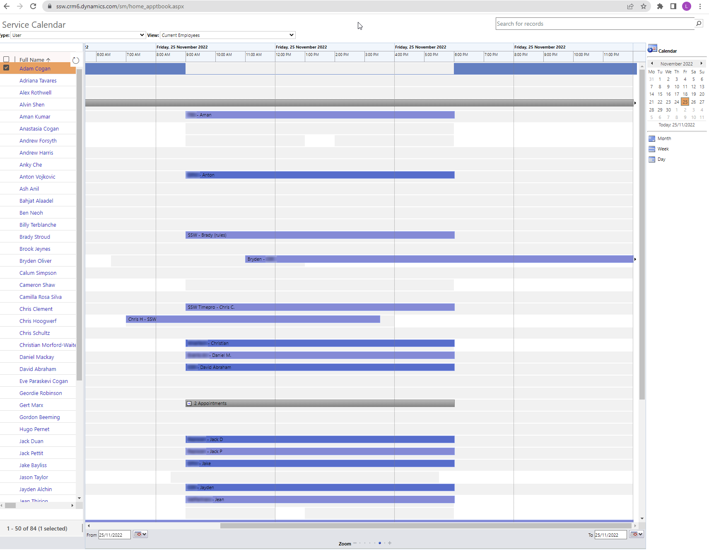

When an Account Manager and a client have made an agreement that a developer will work on a particular project for a day, the dev needs to work on it all day (at least 8 hours), and that should be reflected in their timesheets.

If the dev is booked in on the Service Calendar in CRM, they will be billing that full day to the respective client. Let's see 2 examples:

<!--endintro-->

::: greybox

- Developer X comes in in the morning
- Checks inbox, replies to a few emails, gets a coffee
- Looks at the calendar to see what they are supposed to work on that day
- Spends some time getting up to speed on the tasks involved
- Then starts billing once they have started work on a specific task for a client

:::
::: bad
Bad example: Scenario where developer bills a partial day
:::

The bad example scenario is not acceptable as the full day will be billed to the client as per the agreement, so it's up to them to make sure they're as productive as possible.

::: greybox

- Developer checks their calendar or the CRM Service Calendar the day before and knows what client they are going to work on before they come in
- Arrives (with a double shot of coffee) and starts billing as they open the computer and sets up the development environment
- Works and bills all day regardless of distractions and other people
- Does not stop to wait on someone else because of a dependency, but continues to find ways to deliver value
- The full 8 hours is billed to the client

:::
::: good
Good example: The developer knows ahead of time what they're working on and bills the full day
:::

The major benefits of the good example (working full days for the client) is that the Service Calendar will be an accurate representation of what will be worked on, and when a client thinks they have a resource booked for a day, they do in fact get the full day.

There will of course be exceptions, such as emergencies or urgent work coming up, but 90% of the time, full days should be billed to 1 client.

