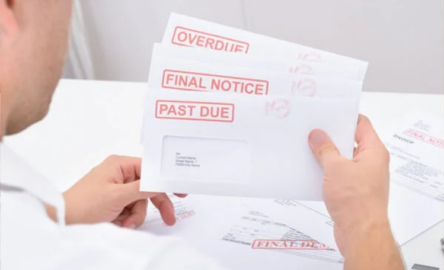

A compliance sheet is a detailed document or tool used by companies to track and manage their compliance obligations. This sheet includes a list of all important lodgements, payments, and other regulatory requirements that need to be fulfilled by specific deadlines.

By systematically recording these obligations, the compliance sheet helps businesses ensure they meet all their legal and financial responsibilities in a timely manner.

<!--endintro-->

The compliance sheet typically includes:

* **Deadlines**: Specific dates for when each obligation is due
* **Descriptions**: Brief descriptions of the obligations (e.g. tax lodgements, payroll taxes, and other regulatory filings)
* **Responsible Parties**: Names or roles of individuals responsible for ensuring each task is completed
* **Status Updates**: Current status of each obligation (e.g. pending, completed, overdue)
* **Reminders**: Alerts or reminders for upcoming due dates

### ❌ What if you miss important due dates

When a company forgets or overlooks important due dates for tax lodgements, payroll taxes, and other critical financial obligations, it can lead to a multitude of issues that adversely affect the business, such as:
financial penalties, legal repercussions, cash flow disruptions, reputational damage, operational interruptions, etc.

Understanding these potential problems highlights the necessity of maintaining a detailed compliance sheet.

### ✅ Why you need a Compliance Sheet

Implementing a Company Compliance Sheet can significantly mitigate the risks associated with missing important due dates. Here are several reasons why a compliance sheet is crucial for any business:

* **Ensures Timely Compliance**: A compliance sheet tracks all important due dates and deadlines, providing reminders and alerts for upcoming submissions
* **Financial Management**: By avoiding unnecessary financial penalties and interest charges, a compliance sheet supports accurate budgeting and cash flow management
* **Legal Compliance**: A compliance sheet ensures adherence to legal and regulatory requirements, reducing the risk of legal actions and audits
* **Operational Efficiency**: Streamlining the compliance process reduces the administrative burden on employees, improving overall organizational efficiency and productivity
* **Reputation and Credibility**: Building trust with stakeholders, clients, and partners is essential for business growth
* **Risk Management**: Identifying and mitigating compliance-related risks is crucial for strategic decision-making

Implementing a Company Compliance Sheet ensures your business remains compliant with all regulatory requirements, maintains financial stability, and upholds its reputation.

By tracking and managing all lodgements and payments, your company can focus on growth and success without the worry of compliance-related issues.
