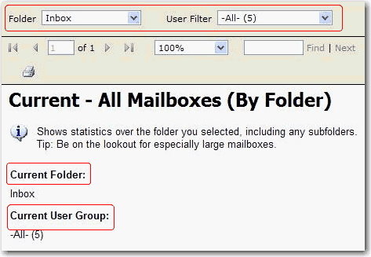
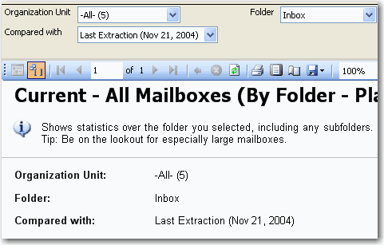

All display names referring to the same parameter should be consistent in everywhere of your reports. In addition, the parameter name and value should be in the same line if possible.

<!--endintro-->

::: bad  
  
:::

::: good  

:::

::: greybox
**Note: If your data is not live, but based on ETL/SSIS**
Then each time log each import to a table Eg. Once a week. Then on the report parameters show this - so users know how old the data is.
:::
