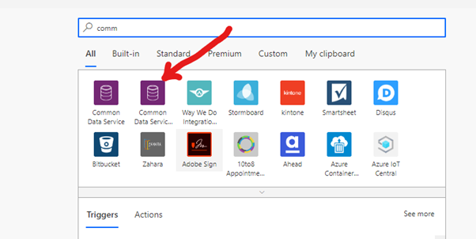

When creating workflows in Dynamics developers take for granted when a solution file is moved across environments, things just work. To achieve the same with Flows we need to make sure that when connecting to Dynamics using the Common Data Service connector, we in fact connect with Common Data Service (Current Environment) connector. This connector is environmentally aware and will immediately work when the parent solution is deployed to another environment, it doesn't require any post-deployment steps.

<!--endintro-->

**Tip:** When searching for Common Data Services (Current Environment) it’s very easy to pick the wrong one...

