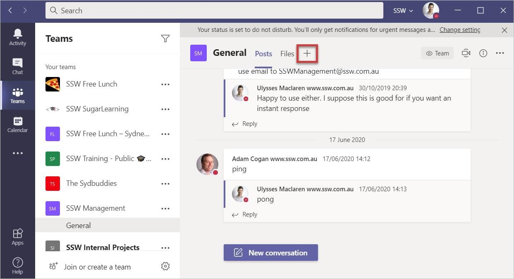
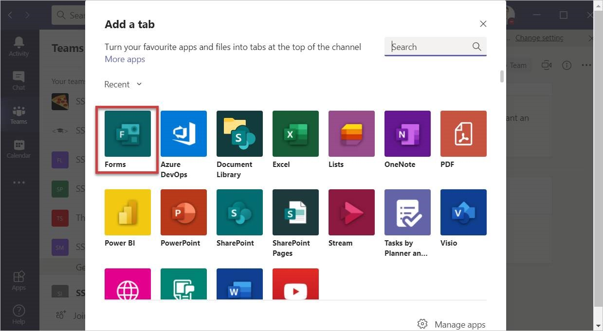
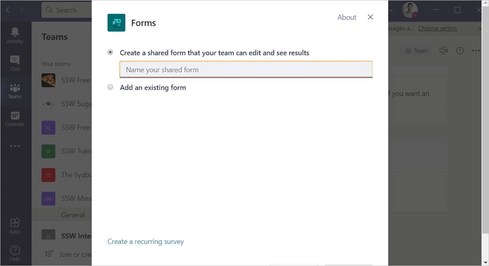
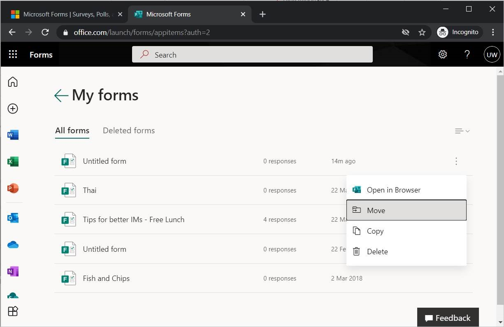

Microsoft Forms is a great way to send out a quick survey to a group of people to get feedback, come to a consensus, or organize team events.

It’s very easy to log in and send one out from your own Office 365 account, but then only you can see the results. A better way is instead to create it from a Group (note every Microsoft Team has a Group).

<!--endintro-->

1. To do this, follow these steps:
2. Go to Microsoft Teams
3. Navigate to the team you’d like to be able to see the results of the form

If you do accidentally create a personal form instead of a group form, you can move it to a group in http://forms.microsoft.com by clicking “All my forms” | … | “Move”

