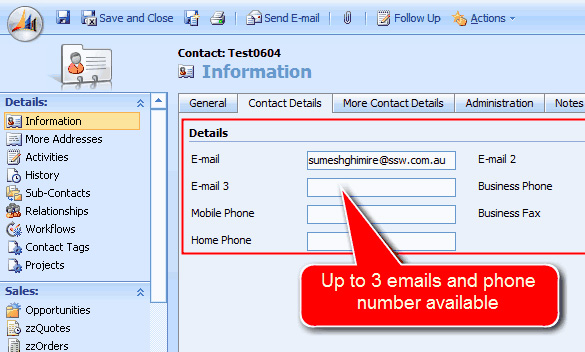
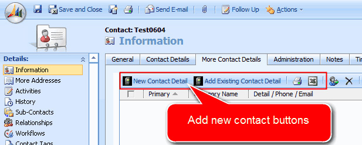
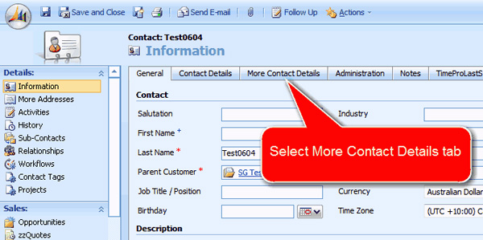
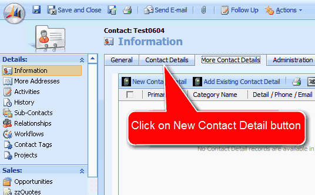
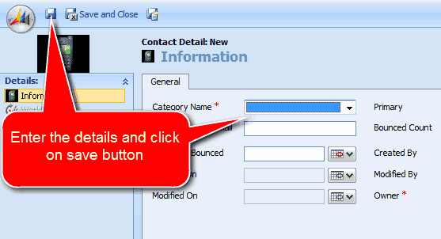

Out of the box CRM4 only enables a contact to have 3 phone numbers (home, business and mobile) + 3 email addresses (but only one visible). A customization that almost everyone needs is to remove this limitation (to allow contacts to have an unlimited amount of phone numbers and email addresses).

<!--endintro-->

::: bad  
  
:::

There are a few customizations needed to get the SSW Contact Makeover:

- Show some hidden fields
- Make some form changes to move to a new tab
- Make a CRM frame (to add in a subform)
- Add some entities
- Add some form java script to hide the core Contact Details? tab when a user is
  entering a new contact

::: good  
  
:::

::: good  
  
:::

Q: So what is the end result?
A: The end user experience to add a phone number is ..

