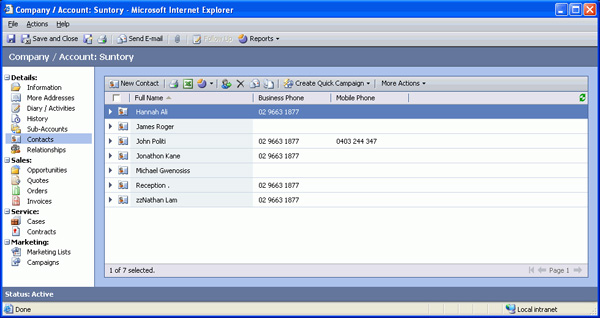
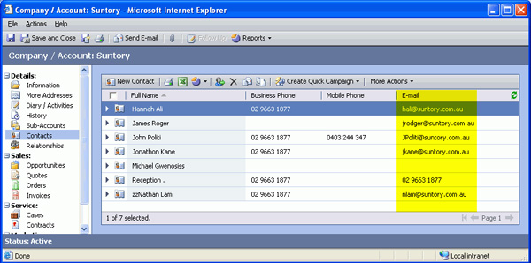

In default view for Associated Contact you cannot see the email address, it would be better to customize it as an extra column.

<!--endintro-->

::: bad  
  
:::

::: good  
  
:::

It is easy to do this by import the [customisations xml files](http://www.ssw.com.au/ssw/Standards/BetterSoftwareSuggestions/CRM.aspx#Customizations).
