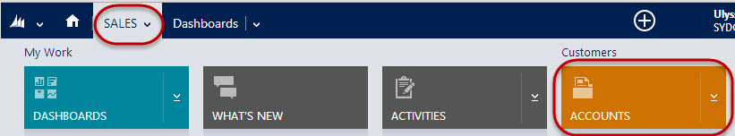
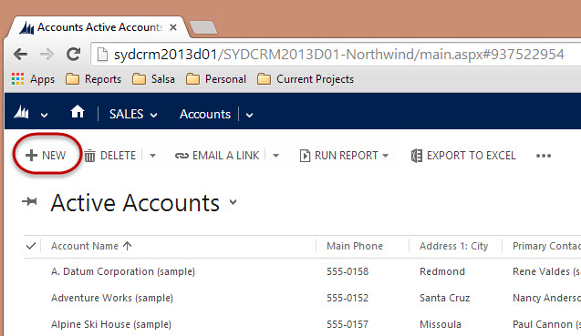

Although you can create a Contact first, it's better to always create the Company first so you don't get orphan Contacts.

\*\*
\*\*

**Tip #1:** Avoid duplicates - Make sure that there is no existing company before you make the entry.

**Tip #2:** Generally you should be [creating these from leads](/data-entry-do-you-know-the-quick-way-to-create-a-contact-account-and-opportunity-in-1-go), as it speeds up the process.

<!--endintro-->

::: good  
  
:::

::: good  
  
:::
