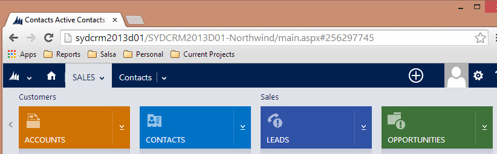
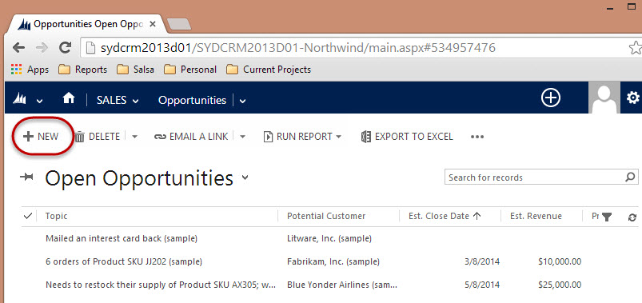

You need to know what's in the sales pipeline, and the way to do that is by entering a potential sale and it's value.
\*\*
\*\*

**Note:** In order to enter new Opportunities into CRM, the company the Opportunity belongs to must already exist.

<!--endintro-->

::: good  
  
:::

::: good  
  
:::
