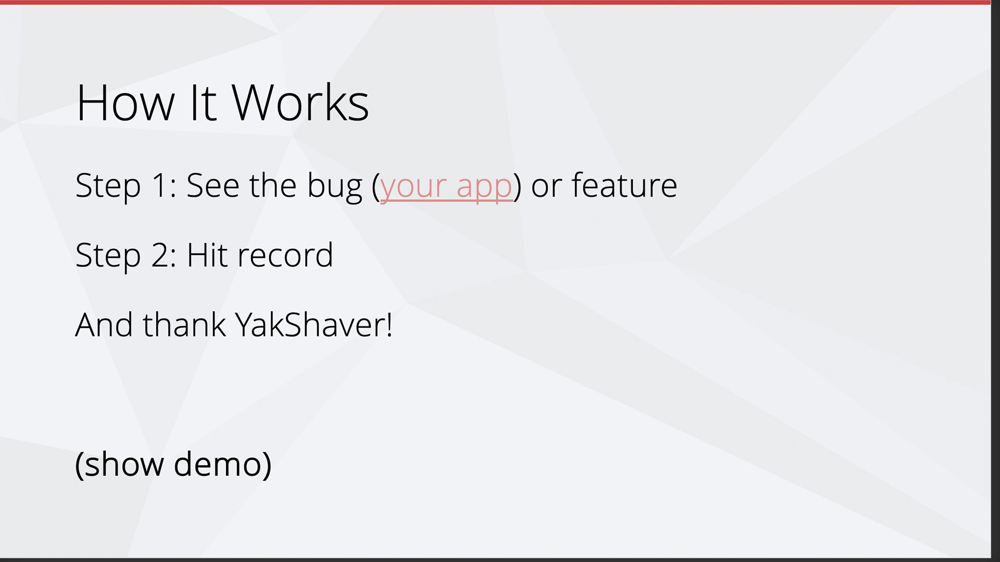
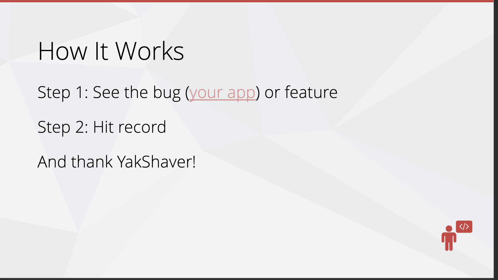

By placing a little visual cue on your slide, you can remind yourself to show a demo to the audience. Avoid displaying the word 'demo', because when out of time, presenters say _"Sorry, let's skip that demo since I am short of time"_ and leave the audience frustrated.

<!--endintro-->

The icon allows you to skip it when running short on time, without upsetting the audience.

::: bad

:::

::: good

:::

## Add key screenshots after 'Demo' slides

After your live demo slide, include the key screenshots that summarize the demo. This allows you to quickly revisit what was shown, and recap the message in under a minute.

**Bonus:** Screenshots act as your **backup plan**. If your demo fails due to something unexpected (e.g. not enough time, no internet, or a broken API), you can still quickly walk your audience through the flow using these images. This small addition can turn a potentially awkward moment into a confident recovery.
