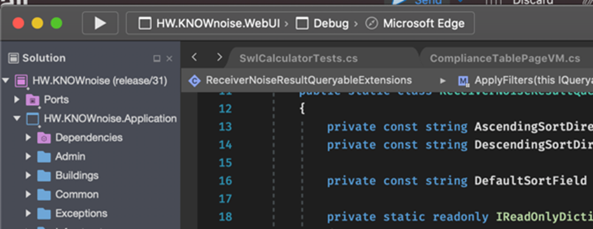

It's amazing how often you can't simply Clone a repository (aka "Get Latest") and compile it.

A good developer makes it clear how to get a new project, compile it and run it.

<!--endintro-->

### Sometimes the experience is more CLI based

### Sometimes the experience is more Mac-based

### Project Setup - What you need to know?

There are tonnes of important things to get right with project setup. Including:

- [Making the project setup as easy as possible](/project-setup)
- [Containerizing your dev environment](/dev-containers)
