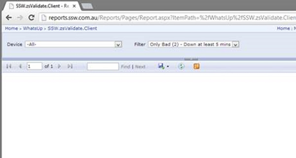
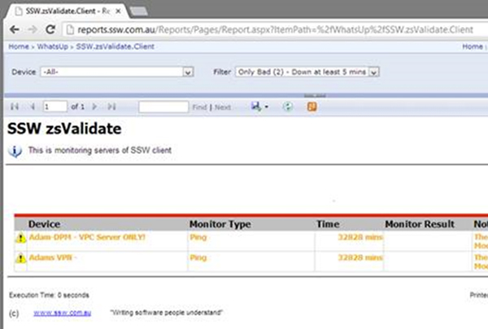

SQL Reporting Services works great with Internet Explorer but other browsers sometimes don’t work correctly, Here’s the solution.

<!--endintro-->

::: bad  
  
:::

This issue is caused by Reporting Services emitting Quirks Mode HTML, to fix this make the following changes to the ReportingServices.js file the full path to this file is:

::: greybox
C:\Program Files\Microsoft SQL Server\MSRS10_50.MSSQLSERVER\Reporting Services\ReportManager\js\ReportingServices.js
:::

Add the following java script:

```sql
function pageLoad() {    
var element = document.getElementById("ctl31_ctl10");
if (element) 
{
       element.style.overflow = "visible"; 
} }
```

Once this change is made reports will be visible.

::: good  

:::

More information at: [stackoverflow.com/questions/5968082/ssrs-2008-r2-reports-are-blank-in-safari-and-chrome](https://stackoverflow.com/questions/5968082/ssrs-2008-r2-ssrs-2012-reportviewer-reports-are-blank-in-safari-and-chrome)

Read [how to display reports properly for Reporting Services 2005/2008](https://www.ssw.com.au/ssw/Standards/Rules/RulesToBetterSQLReportingServices.aspx#FirefoxChromeReportDisplay20052008).
