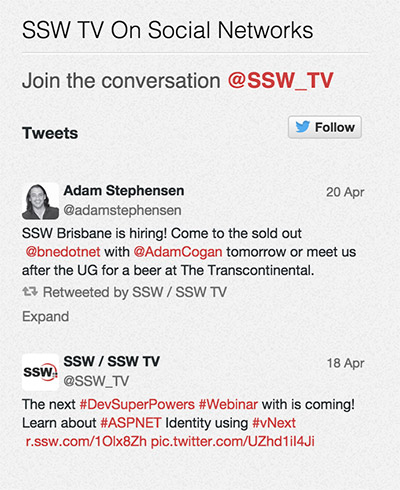

People don't go to your Twitter profile as often as they visit your website. It's a good idea to have your Twitter timeline on your website. The Embeddable timelines are interactive and also enable your visitors to reply, Retweet, and favorite Tweets directly from your website pages. The best place to put it is on the sidebar.

<!--endintro-->

Visit https://dev.twitter.com/web/embedded-timelines to view instructions on creating your embedded Twitter timeline.

**Note:** Visit [Facebook's Page Plugin](https://developers.facebook.com/docs/plugins/page-plugin) to also integrate a Facebook Like Box to your website
