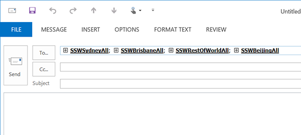
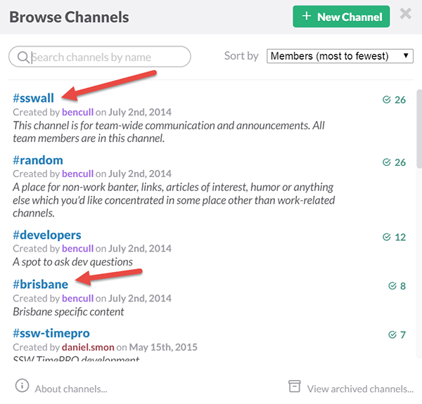

When adopting a new technology it can sometimes help to include a familiar paradigm. This helps users see how their understanding of the old technology applies to the new one.

Companies should have Email Groups for the main offices, and one for the rest of the world. To help figuring out what channels to be posting to and what content is appropriate, recreate these groups as Slack channels.

<!--endintro-->

