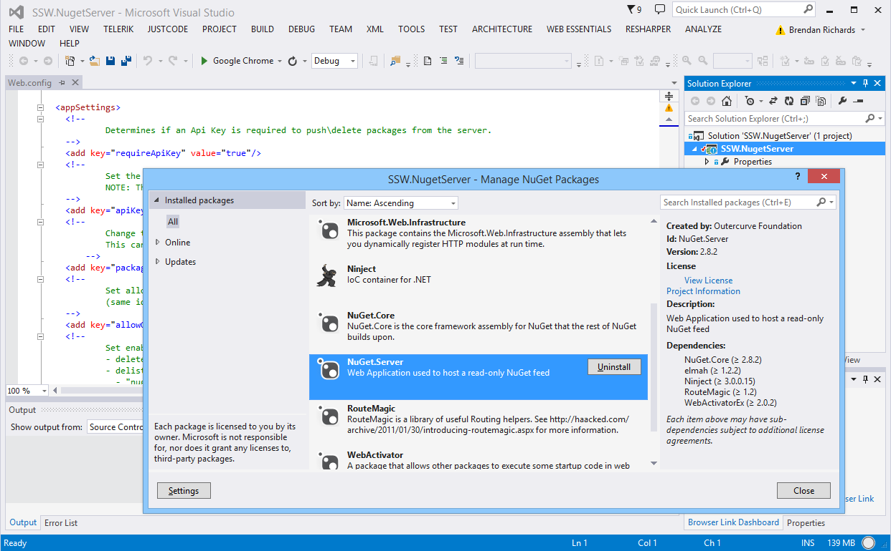
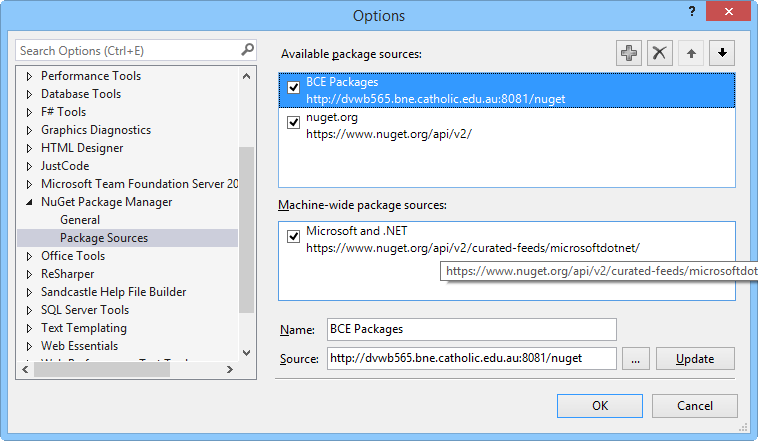

Nuget is great for managing publicly available packages, but it’s also surprisingly easy to create and publish your own packages to your own nuget server for internal code reuse across multiple solutions.

<!--endintro-->

