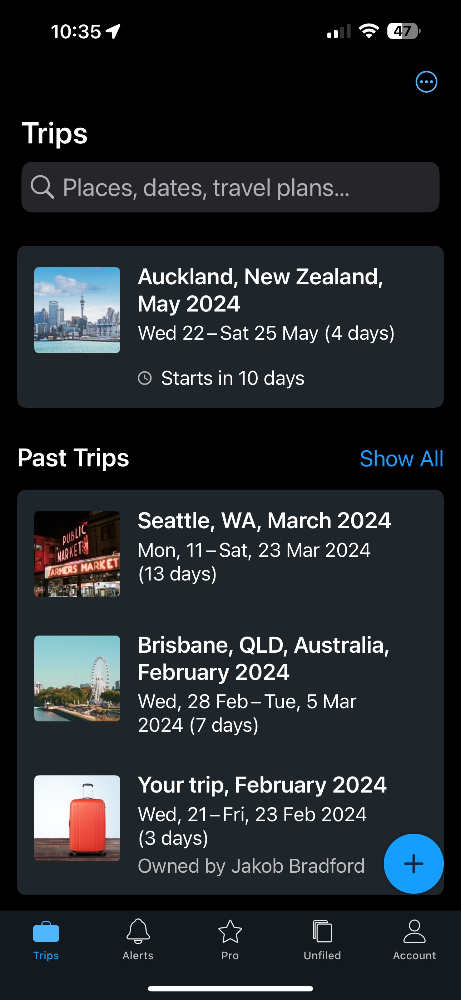
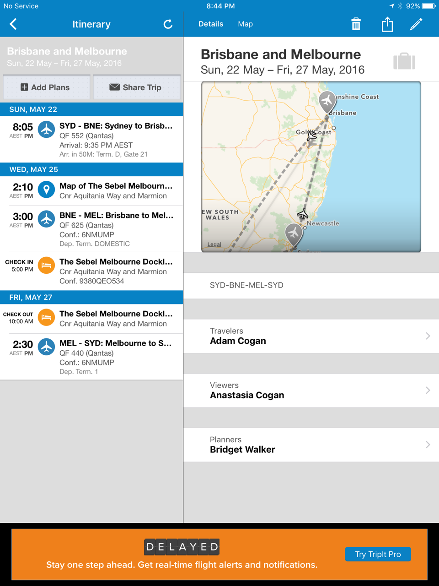

As well as sending details of bookings to the traveler's Outlook calendar, you should also use [tripit.com](https://www.tripit.com) to consolidate the details of bookings for flights, hotels, car rentals, etc.

TripIt can make a single, easy-to-read online itinerary that can be viewed by anyone you choose to share the link with, making it easy to keep co-travelers, spouses, co-workers, and others in the loop.

::: greybox

Adam Cogan loves TripIt and uses it every time he travels. He says:

"TripIt tells you when there’s a delay, a gate change, your baggage info, or any other problems that might happen ...

Plus, I share the flight with a bunch of people including those who are picking me up … so they get notified too"
:::

<!--endintro-->

After joining tripit.com, forward a copy of each booking confirmation to [plans@tripit.com](mailto:plans@tripit.com) to store the details of upcoming journeys.

Multiple items can then be merged to form one master itinerary that covers the whole trip.

