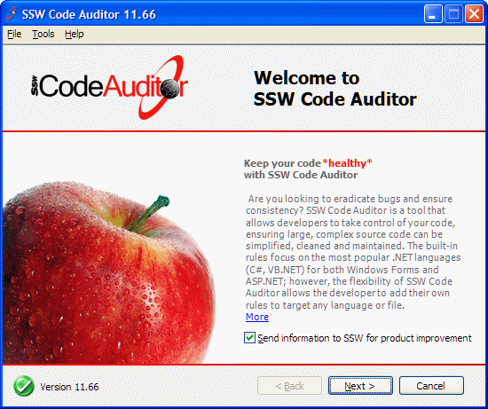
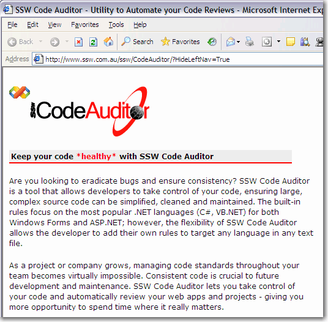

When you have a link in your application, use the same text layout as below and a "More" hyperlink to the same page with the same description. The resulting effect is when the user clicks on the "More" hyperlink, the page will begin with exactly the same information again. This ensures the user is never confused when navigating from your application to a link.

<!--endintro-->

