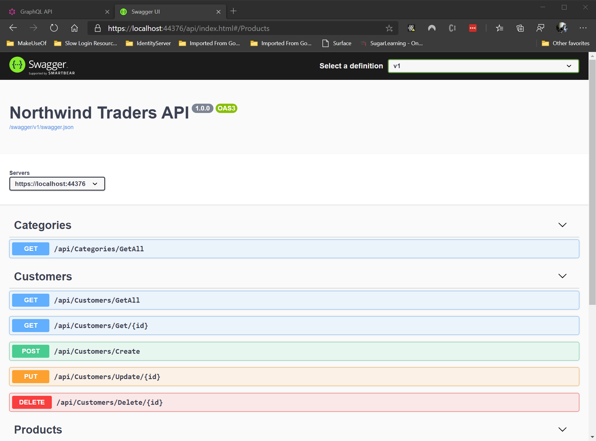

Documenting your WebAPI is important but you don't want to spend a massive amount of time trying to keep documentation up to date. The solution is to use [Swagger](https://github.com/OAI/OpenAPI-Specification/blob/master/versions/2.0.md)and [Swashbuckle](https://github.com/domaindrivendev/Swashbuckle).

<!--endintro-->

Implementing Swagger will give you an automatic UI to explore and test your Web API methods.

::: good
Swagger gives you a nice UI automatically generated on top of your WebAPI methods

:::
