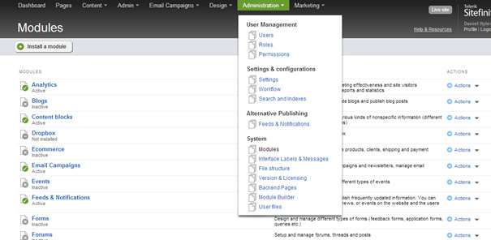

Initial Sitefinity load times are quite bad.
On a live site you can do things like keeping the site warm though IIS however for developers this process takes quite a bit of time.

<!--endintro-->

Sitefinity caches everything, checks licenses, creates in memory pages from the content in the DB, etc.
There will be a lot of small quick query's against the Sitefinity SQL database and it is important that these remain quick.

1. Only compile when you are sure your code will work. It is also a good idea to complete 2 or 3 different things that you can test upon a rebuild to save time.
2. Disable Sitefinity modules that you are not using or don't need.
We recommend disabling all modules and only enabling items that you require.
    You can access the Module list via the Sitefinity backend.

  

3. Ensure that the Sitefinity database is indexed and the Statistics are updated.
This will ensure that the Sitefinity query's remain quick: [Sitefinity Database maintenance](http://knowledgebase.progress.com/articles/Article/Sitefinity-Database-maintenance)
4. Use a reflection tool like DotTrace that can show you what is slow on application start time.
Using this method we determined that Sitefinity was using reflection on assemblies to find any MVC widgets and add them into the Sitefinity widget list. This process took a few seconds and we removed tags to speed this up.

**Telerik Suggestion:** Have a best practise analyser wizard that is available in the backend which will look at the project and what is used and recommend settings that could be changed, modules that are not used, and any other improvements that can be applied.
