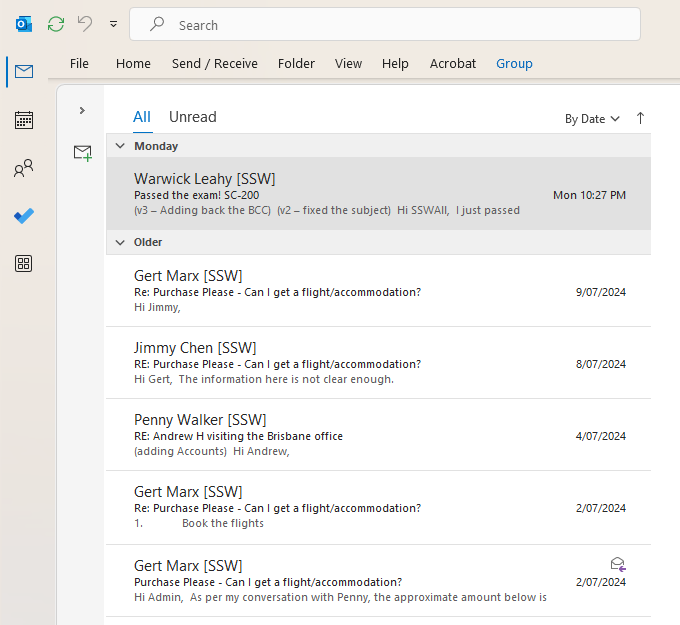
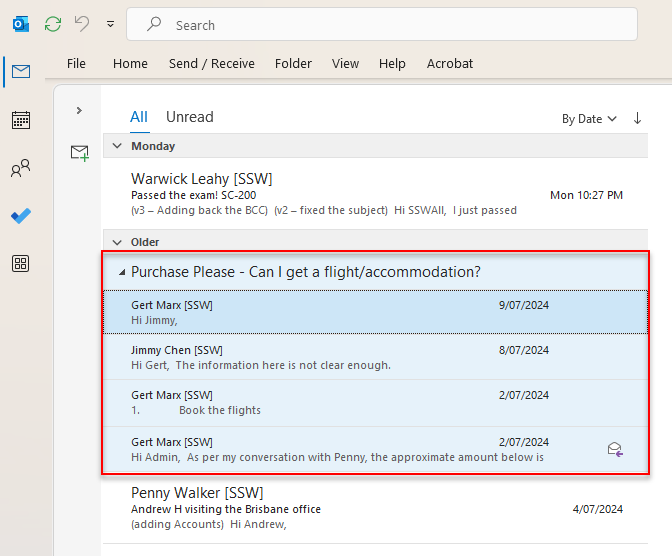
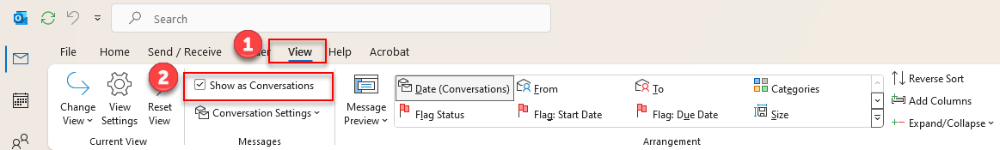

You may be involved in different tasks simultaneously every day. The best way to organize your tasks and follow each task individually is grouping your emails by conversation. By default, Outlook sorts the emails by Date.

<!--endintro-->

::: bad  
  
:::

::: good  
  
:::

Follow these steps to group by conversation:

Let's take the Outlook Version 2410 as an example,

1. Open Outlook and select "View" on the ribbon.
2. Tick the "Show as Conversations" option as displayed in the image.

3. You can find more settings in the next option.

**VIDEO** - [Top 10+ Rules to Better Email Communication with Ulysses Maclaren](https://www.youtube.com/watch?v=LAqRokqq4jI)
