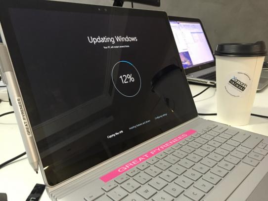

When we configure networks we give all computers in the company a naming theme like:

- Buildings
- Cars
- Countries
- Colours
- Fruits
- Vegetables, etc

<!--endintro-->

::: info
At SSW we have adopted the **animal kingdom**.

:::

While you are attaching the label, it is also a good idea to affix a business card to the underside of the computer. This way if you lose your machine, anyone who finds it can easily contact you.
