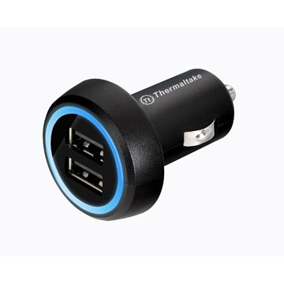

Car manufacturers should get rid of the cigarette lighter, smokers use the usual portable lighters and everyone else uses them as a power source. So instead, why not just give us lots of USB ports to plug in our phone, iPod, camera and all the other gadgets we all seem to carry around these days!

<!--endintro-->

In the meantime, buy a 1000mA Car USB Adaptor (there are heaps of places you can buy one, and [Google Search results](https://www.google.com/search?hl=en&q=usb+car+charger+adaptor) will show you heaps of places to start)

Note: Don't get the old 400mA adaptors (which supply enough power for the majority of USB devices) instead, get a more powerful one for items such as iPads

