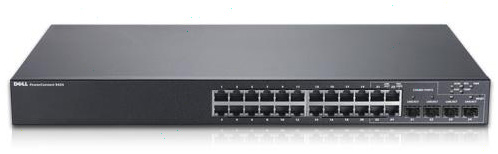

Having the network flooded with a virus is bad news – but it will be worse news if iSCSI traffic is going across the same network. This is why you should have your iSCSI or SAN traffic on a different VLAN.

<!--endintro-->

**Figure: A managed switch allows VLANing**
Note: An even better and more expensive solution is purchase a separate Switch for each network (this example means 3 network adapters = 3 networks)
