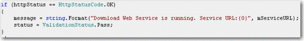
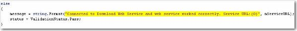

It is a good practice to highlight string variables or const in source code editor of Visual Studio to make them clear. Strings can be easily found especially you have long source code.
<figureEmbed figureEmbed={{
  preset: "badExample",
  figure: '',
  shouldDisplay: true
} } />

<figureEmbed figureEmbed={{
  preset: "goodExample",
  figure: '',
  shouldDisplay: true
} } />

<figureEmbed figureEmbed={{
  preset: "goodExample",
  figure: '',
  shouldDisplay: true
} } />
