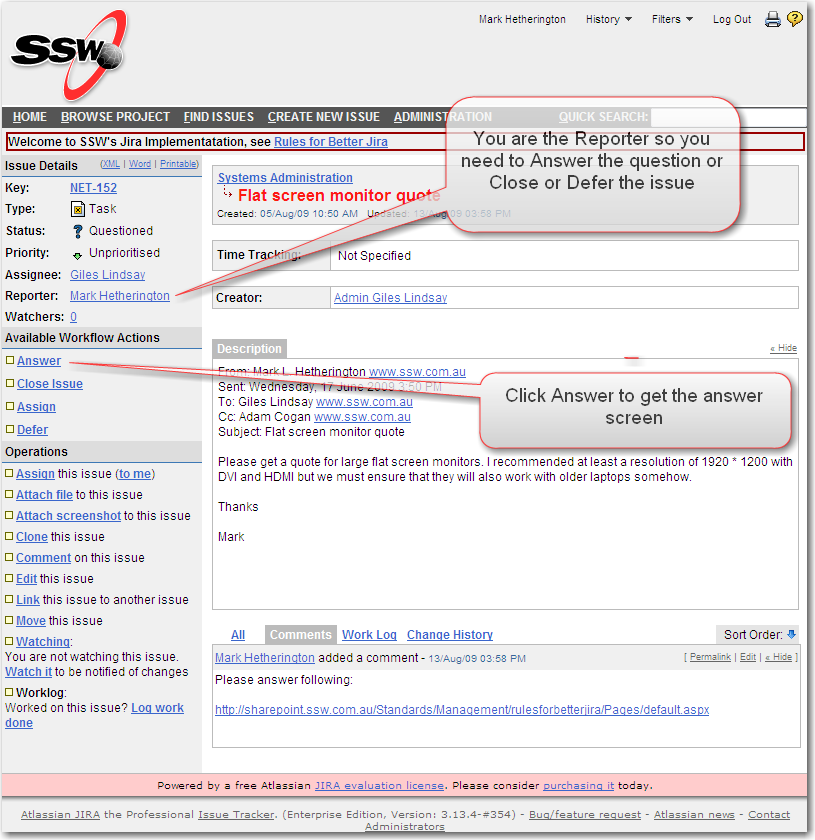
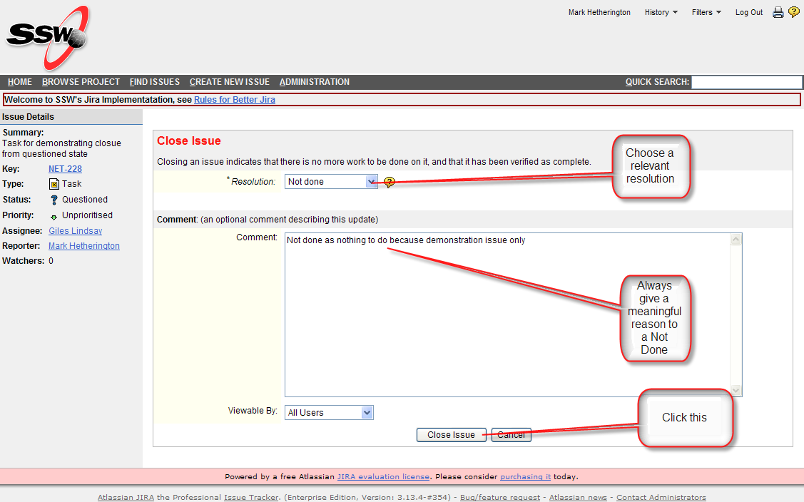
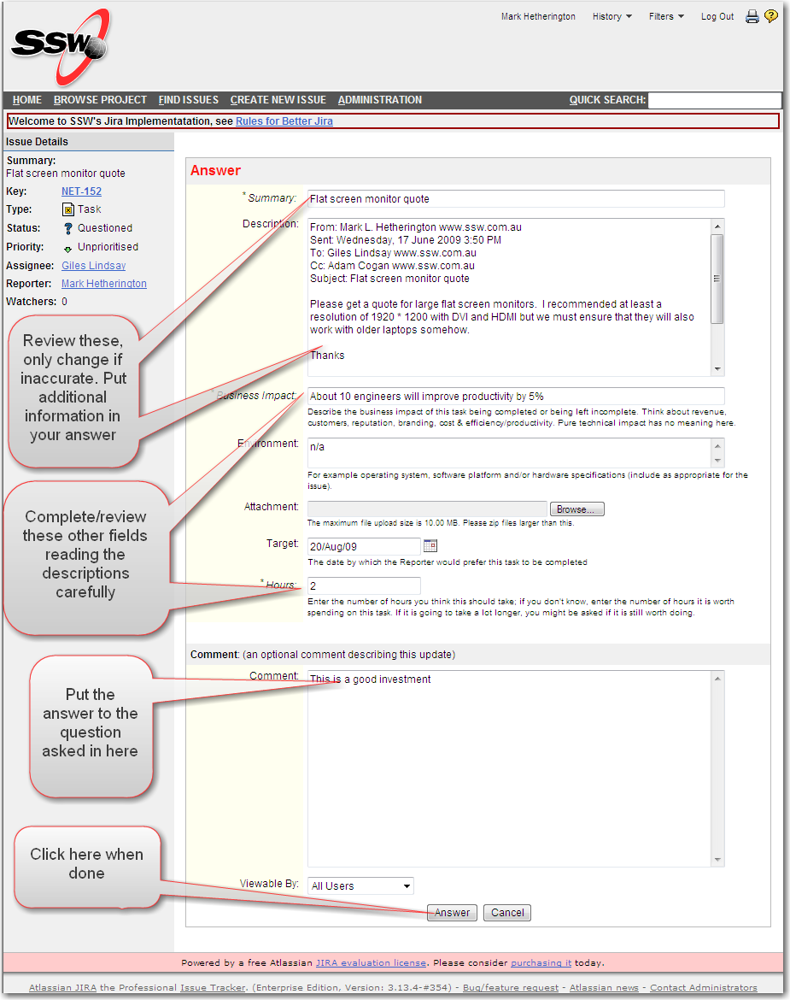

On receiving an email from Jira with "Questioned" in the subject or seeing a questioned task in your dashboard, you should open the task .....

<!--endintro-->

You can open the relevant task in two ways:

- selecting it from your [System Dashboard](/do-you-know-how-to-answer-a-question-in-jira) (Home in Jira) where it will appear in the left column, see [rules page on dashboard](/do-you-know-how-your-system-dashboard-can-help-you-this-is-the-most-important-feature-in-jira)
- by clicking on the link of the "Questioned" email. If you are not logged in you you will be asked to do so; [this is how](/do-you-know-how-to-login-to-jira)

Once the task is displayed:

You decide whether it is still required or not.
If it isn't - select Close and choose a relevant resolution:

Otherwise, if it is still required, select Answer and complete the fields as shown, please read the description of the fields carefully:

Once you have completed all required fields and pressed the Answer button, the task will be saved and put back on the Assignee's "New" queue.

You can see how this is part of the [workflow](/do-you-really-know-what-a-jira-workflow-is).
