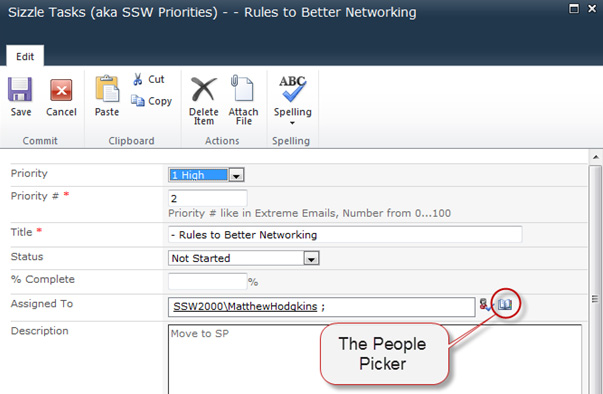
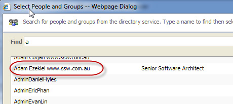
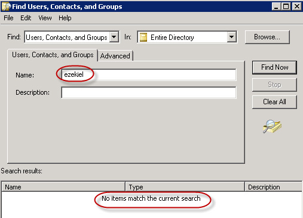
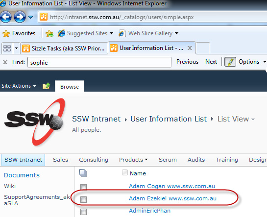

The SharePoint "People Picker" is a great tool for quickly selecting users of your SharePoint site. It allows you to quickly select users from your organization by browsing Active Directory.

<!--endintro-->

Unfortunately, if you have added users directly to your site collection, and later deleted or disabled them from Active Directory, you will notice that these orphaned users will still appear in your People Picker. This will eventually clutter up your People Picker.

To remove these orphaned users, as a SharePoint Administrator, you can open the following URL (where <www.northwind.com> is your SharePoint URL):

- `http://www.northwind.com/\_catalogs/users/sample.aspx`

On this page you will find a list of all the users that are members of your site collection, including the orphaned users.

To remove the user simply click on the **Username** | Click **Delete User from Site Collection** . This will instantly remove the user from the People Picker.
