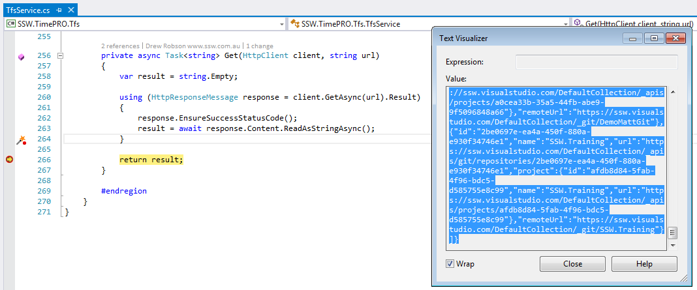

When integrating with external Web APIs which return a JSON response, there is a quick and easy way to generate classes to handle that response.

<!--endintro-->

If the API specification is published as per our rule: [Do you document your Web API?](/do-you-document-your-webapi)

You can automatically generate your classes from that specification. See our other rule on how to do this: [Do you know the best way to generate your classes from swagger?](/the-best-way-the-best-way-to-generate-your-entities-from-swagger)
If the specification isn't publised you need to generate your clases from the response you get from calling the API. Here is a trick to do that.

Execute the request, and copy the text of the JSON response.

Create a new class in Visual Studio, and Click Edit | Paste Special | Past As JSON Classes and classes will be generated from the JSON in the clipboard.

**Figure: Edit | Paste Special | Paste JSON As Classes**

**Figure: Classes generated from the JSON**

The results may need cleaning up a little bit, but its much easier than trying to write them manually.
