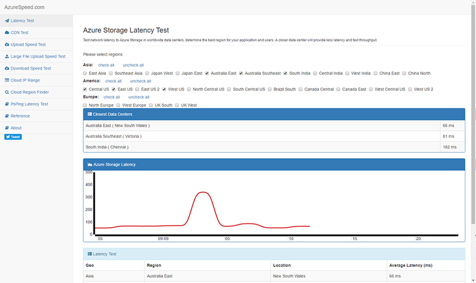

Here's a cool site that tests the latency of Azure Data Centres from your machine. It can be used to work out which Azure Data Centre is best for your project based on the target user audience: [http://www.azurespeed.com](http://www.azurespeed.com/)

<!--endintro-->

As well as testing latency it has additional tests that come in handy like:

- CDN Test
- Upload Test
- Large File Upload Test
- Download Test

