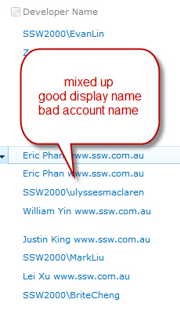
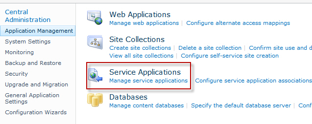
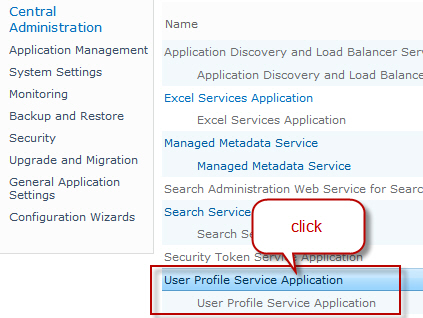
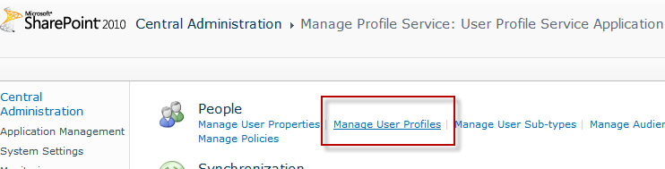
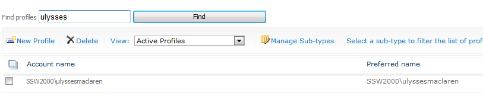

When SharePoint encounters a new person, it takes people's display name and account name from Active Directory, but sometimes

<!--endintro-->

**Figure: Mixed up names - some are good Display Name, some are essentially just the Account Name** (More here)

The easiest way to fix this requires someone with central administration access:1. Go to: SharePoint Central Administration | Application Management | Service Applications | Manage Service applications
 2. Go to User Profile Service Application
 3. Go to Manage User Profiles
 4. Find the user profile that you want to update
 5. Fix the Name field (Display name)
 6. Save

Better way
The better way is to set up User Profile Synchronization and have SharePoint communicate with Active Directory on a schedule and keep user's profile information up to date. Unfortunately, it can be tricky to set this up in SharePoint 2010.

Technical
When a user is entered (or using) a SharePoint site, the site will first check with Central Admin (the farm) to enquire about this user's profile details. The farm grabs the account name and display name from Active Directory, but does not keep this synchronized.

Unless configured otherwise, end users in SharePoint do not have the ability to modify their own display name. And the best place to update this is to either:

1. Modify the farm user information list cache (via steps above), or
2. Set up User Profile Synchronization
