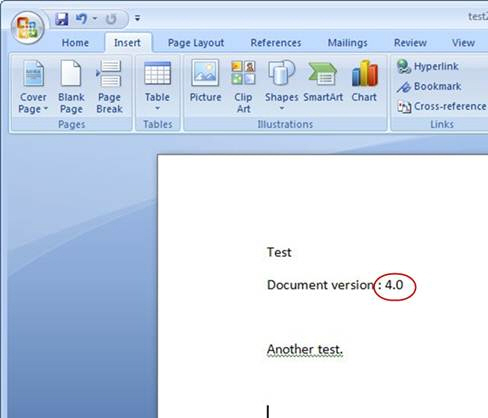
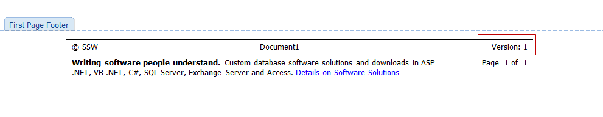
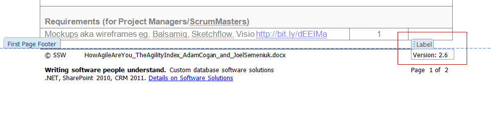

We are always disappointed when adding version information to a Word document. When you use the Word version you get a number that indicates the number of times the document has been saved and not a proper version number.

It is possible to get the number into Word for the version of the document on the SharePoint document library.

<!--endintro-->

::: info
**Note:** This also works in SharePoint 2010 and Office 2010.
:::

::: good  
  
:::

::: bad  
  
:::

::: good  
  
:::
